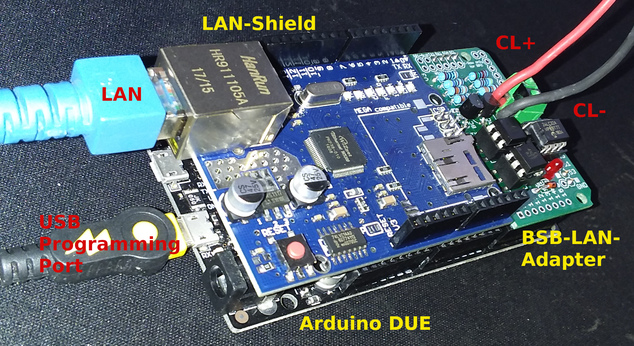

[Back to Introduction](index2.md)  

   
---   
       
# Quick Start Guide for [Arduino Due](chap01.md#12-arduino-due)  
***The following brief instructions do not replace the reading of the detailed manual!***  
***Please also read the respective more detailed explanations in the corresponding chapters.***  

---

***Caution: Electrostatic charges can cause irreparable damage - ground yourself before starting work!***  

---
   
Prepare the setup by plugging the LAN shield and the adapter onto the Arduino Due, plug in a LAN cable and connect the Arduino setup to your computer with a USB cable. Make sure you are using the 'Programming Port' of the Due, which is the USB port in the middle, right next to the power supply.  
If your computer does not recognize the Due automatically, you have to install the appropriate driver for your operating system.  
  
  
    
*The complete setup (Arduino Due + LAN shield + BSB-LPB-LAN adapter v3), belonging cables included.*      
  
Now proceed with the following steps:    
  
1. Download and install the latest version of the [ArduinoIDE](https://www.arduino.cc/en/Main/Software).  

2. Download the [current version of BSB-LAN](https://github.com/fredlcore/bsb_lan/archive/master.zip).  

3. Unzip the downloaded file "BSB_LAN-master.zip" and enter it.  

4. Enter the folder "BSB-LAN-master"/"BSB_LAN" and rename the files *BSB_LAN_custom_defs.h.default* to ***BSB_LAN_custom_defs.h*** and *BSB_LAN_config.h.default* to ***BSB_LAN_config.h***!  

5. Start the ArduinoIDE by double-clicking the file "BSB_LAN.ino" in the BSB_LAN folder.  
  
   - Check the correct serial port where the Arduino Due is connected to the computer under "Tools/Port".  
  
   - Set the transfer speed/baud rate to 115200.  
  
   | Note |
   |:-----|
   | If you encounter problems until here (e.g. the board is not recognized), please read the detailed description in [chapter 2.1.1](chap02.md#211-installation-onto-the-due). |    

6. Adjust the settings in the file "BSB_LAN_config.h" according to your wishes and circumstances.  
   This applies in particular to settings regarding the use of DHCP, a possibly different IP address, and the optional security functions.  
  
   When all settings are adjusted, start the flash process by clicking on "Sketch/Upload" or "Sketch/Upload".  
  
   | Note |
   |:-----|
   | In addition to the adjustment of the file "BSB_LAN_config.h" the adjustment of the configuration of BSB-LAN can also be done later via web interface. |   
   | Further hints as well as a description of all configuration options can be found in [chapter 2.2](chap02.md#22-configuration)! |    
  
7. After finishing the flash process start the [Serial Monitor of the Arduino IDE](chap12.md#122-serial-monitor) and watch the output which is done when starting the Arduino.  
   Among other things, the IP that is assigned to the setup when using DHCP is displayed there.  
  
   After finishing the startup process, **it's advisable to disconnect the power supply of the Arduino**, that means removing the board from the USB port of your computer. This is not mandatory, but recommended for safety reasons.  
  
8. **Switch off your heating system so that the controller is no longer power supplied.**  
  
   Now connect the adapter of the Arduino setup to the controller.  
   To do this, connect the controller-side connections "CL +" and "CL-" (for BSB use) or "DB" and "MB" (for LPB use) to the identically named connections of the adapter.  
   Pay attention to the correct connection: The connected connections must be *the same*, e.g. "CL +" to "CL +" and "CL-" to "CL-"!  

   | Note |
   |:-----|
   | For detailed instructions on how to connect a controller with PPS connections and illustrations of various controllers and the corresponding connections to be used, please refer to [chapter 3.1](chap03.md#31-connecting-the-adapter)! |    

9. Switch on the heating system / the controller.

10. Restart the setup by pressing the reset button or restore the power supply of the Arduino setup, ideally with a specific power supply with connection to the hollow plug socket.  
   If you do not (yet) have a suitable power supply at hand, you can also supply the Arduino setup with power via the USB socket. This can be done either via a powerful USB power supply or via your USB port on the computer.  
   The latter variant is advantageous in that you can use the [Serial Monitor of the Arduino IDE](chap12.md#122-serial-monitor) in parallel to control the startup behavior of the setup.  

11. Start an internet browser and go to the page of the BSB-LAN web interface.  
    It can be found at the IP address you previously set in step 6 (the default is "192.168.178.88").  
    When using DHCP, the IP can be read out from the start sequence of the Arduino Due by using the [Serial Monitor of the Arduino IDE](chap12.md#122-serial-monitor).  

    *If everything is installed correctly, you will now have (limited) access to the controller of your heating system. To gain access to all of the parameters your controller offers, see step 12!*  
    
    | Note |
    |:-----|
    | If -contrary to expectations- errors or problems arise, then *in addition to the chapters already mentioned*, also read chapters [13](chap13.md), [14](chap14.md) and [15](chap15.md). |    
  
12. *You now have to create a device specific file `BSB_LAN_custom_defs.h` to get access to all of the parameters of your controller! Therefore please read [chap. 3.3](chap03.md#33-create-device-specific-parameter-list) and perform the steps mentioned there!*     

Have fun with BSB-LAN wish you Frederik and Ulf! :)  
          
---

    

---  

[Further on to the Quick Start Guide for ESP32 Boards](QSG_ESP32.md)      

