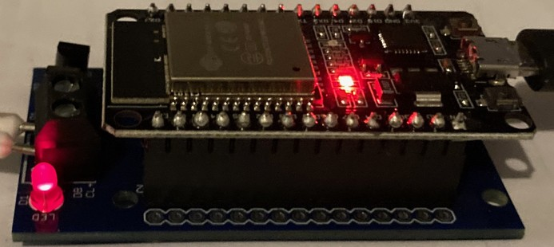
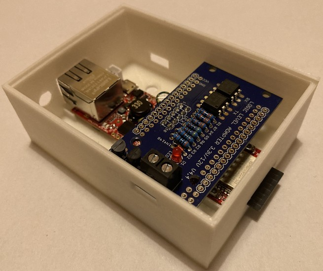

[Back to Quick Start Guide for Arduino Due](QSG_DUE.md)  

   
---   
       
# Quick Start Guide for [ESP32 Boards](chap01.md#13-esp32)  
***The following brief instructions do not replace the reading of the detailed manual!***  
***Please also read the respective more detailed explanations in the corresponding chapters.***  

---

***Caution: Electrostatic charges can cause irreparable damage - ground yourself before starting work!***  

---
   
*Attention: Consider your ESP32 board type in the following instructions!*   

- ***[Joy-It ESP32 NodeMCU](chap01.md#1311-esp32-nodemcu-joy-it)***:  
  Plug the NodeMCU on the BSB-LAN adapter and connect the NodeMCU with a USB cable to your computer.  
  If your computer does not recognize the NodeMCU automatically, you have to install the appropriate driver for your operating system.   
  
    
    
  *The complete setup (Joy-It ESP32 NodeMCU + BSB-LPB-LAN adapter).*      
  
- ***[Olimex ESP32-EVB & ESP32-PoE](chap01.md#1312-esp32-olimex--esp32-evb)***:  
  Plug the BSB-LAN adapter into the Olimex and connect the Olimex with a USB cable to your computer.  
  **When plugging on the adapter board, make sure meticulously that the UEXT1 socket of the board is plugged on** ***exactly in the middle*** **of the Olimex socket and that all pins of the Olimex have contact!** Otherwise, when the adapter is correctly connected to the heating controller, the LED of the adapter lights up, but no access to the controller is possible.  
  **Also ensure that the circuit board is plugged onto the Olimex in the correct orientation (see photo)!**
  
  If your computer does not recognize the Olimex automatically, you have to install the appropriate driver for your operating system.  
  
    
    
  *The complete setup: Olimex ESP32-EVB with the plugged on "BSB-LAN ESP32" adapter v4.2.*  
  
      
  
  *The complete setup: Olimex ESP32-PoE with the plugged on "BSB-LAN ESP32" adapter v4.4.*
  
**Now proceed with the following steps:**    
  
1. Download and install the latest version of the [ArduinoIDE](https://www.arduino.cc/en/Main/Software).  
   Then add the ESP32-SDK via board manager URL (*Attention: use SDK 2.0.2 or higher!*) and install the ESP32 board libraries in the board manager. [Here](chap12.md#1212-esp32) you will find detailed step-by-step instructions. 

2. Download the [current version of BSB-LAN](https://github.com/fredlcore/bsb_lan/archive/master.zip).  

3. Unzip the downloaded file "BSB_LAN-master.zip" and enter it.  

4. Enter the folder "BSB-LAN-master"/"BSB_LAN" and rename the files *BSB_LAN_custom_defs.h.default* to ***BSB_LAN_custom_defs.h*** and *BSB_LAN_config.h.default* to ***BSB_LAN_config.h***!  
   
   - Open the file "BSB_LAN_config.h" and activate the definition '#define WIFI' if you want to use WiFi. If you are using an Olimex board and want to use LAN, please leave the definement deactivated: `//#define WIFI`.  
   
   - If you want to use WiFi, enter the access data for your WiFi network at the entries  
     `char wifi_ssid[32] = "YourWiFiNetwork";` and  
     `char wifi_pass[64] = "YourWiFiPassword";`.  
  
5. Start the ArduinoIDE by double-clicking the file "BSB_LAN.ino" in the BSB_LAN folder.  
  
   - Check the correct serial port to which the ESP32 board is connected to the computer under "Tools/Port".  
  
   - Set the transfer speed/baud rate to 115200  
  
   | Attention |
   |:----------|
   | Now select the appropriate ESP32 board type under Tools/Board or Tools/Board and adjust the board settings! |  
   
   - For the [Joy-It ESP32-NodeMCU](chap01.md#1311-esp32-nodemcu-joy-it) recommended in this manual (or identical clones with an "ESP32-WROOM" chip) the appropriate board type is "ESP32 Dev Module".  
     Then select the variant "Default 4MB with spiffs (1.2BM APP/1.5MB SPIFFS)" for "Partition Scheme".  
     
   - For the recommended [Olimex ESP32-EVB & ESP32-PoE](chap01.md#1312-esp32-olimex-esp32-evb-esp32-poe) please select the entry with the same name from the list.  
     Then select the variant "Minimal SPIFFS (Large APPS with OTA)" for "Partition Scheme".  
  
   | Note |
   |:-----|
   | If you encounter problems until here (e.g. that the board is not recognized), please read the detailed description in [chapter 2.1.2](chap02.md#212-installation-onto-the-esp32)! |      
  
6. Adjust the settings in the file "BSB_LAN_config.h" according to your wishes and circumstances.  
   This applies in particular to settings regarding the use of DHCP, a possibly different IP address, and the optional security functions.  
  
   When all settings are adjusted, start the flash process by clicking on "Sketch/Upload" or "Sketch/Upload".  
  
   | Note |
   |:-----|
   | In addition to the adjustment of the file "BSB_LAN_config.h" the adjustment of the configuration of BSB-LAN can also be done later via web interface. |   
   | Further hints as well as a description of all configuration options can be found in [chapter 2.2](chap02.md#22-configuration)! |    
    
7. After finishing the flash process start the [Serial Monitor of the Arduino IDE](chap12.md#122-serial-monitor) and watch the output which is done when starting the ESP32. Among other things, the IP that is assigned to the setup when using DHCP is displayed there.  
  
   After finishing the startup process, **it's advisable to disconnect the power supply of the ESP32**, that means removing the board from the USB port of your computer. This is not mandatory, but recommended for safety reasons.  
  
8. **Switch off your heating system so that the controller is no longer power supplied.**    
   
   Now connect the adapter of the Arduino setup to the controller.  
   To do this, connect the controller-side connections "CL +" and "CL-" (for BSB use) or "DB" and "MB" (for LPB use) to the identically named connections of the adapter.  
   Pay attention to the correct connection: The connected connections must be *the same*, e.g. "CL +" to "CL +" and "CL-" to "CL-"!  
   
   | Note |
   |:-----|
   | For detailed instructions on how to connect a controller with PPS connections and illustrations of various controllers and the corresponding connections to be used, please refer to [chapter 3.1](chap03.md#31-connecting-the-adapter)! |  
    
9. Switch on the heating system / the controller.

10. Restart the setup by pressing the reset button or restore the power supply of the ESP32 board setup, ideally with a specific power supply with connection to the microUSB socket (NodeMCU) or hollow plug socket (Olimex).  
    If you don't have a suitable power supply at hand (yet), the power can also be supplied via your USB port on the computer.  
    The latter variant is advantageous in that you can use the [Serial Monitor of the Arduino IDE](chap12.md#122-serial-monitor) in parallel to control the startup behavior of the setup.  

11. Start an internet browser and go to the page of the BSB-LAN web interface.  
    It can be found at the IP address you previously set in step 6 (the default is "192.168.178.88").  
    When using DHCP, the IP can be read out from the start sequence of the Arduino Due by using the [Serial Monitor of the Arduino IDE](chap12.md#122-serial-monitor).  
  
    *If everything is installed correctly, you will now have (limited) access to the controller of your heating system. To gain access to all of the parameters your controller offers, see step 12!*    
    
    | Note |
    |:-----|
    | If -contrary to expectations- errors or problems arise, then *in addition to the chapters already mentioned*, also read chapters [13](chap13.md), [14](chap14.md) and [15](chap15.md). |   
     
12. *You now have to create a device specific file `BSB_LAN_custom_defs.h` to get access to all of the parameters of your controller! Therefore please read [chap. 3.3](chap03.md#33-create-device-specific-parameter-list) and perform the steps mentioned there!*      

Have fun with BSB-LAN wish you Frederik and Ulf! :)  
     
---

    
     
---  

[Further on to the Table of Contents](toc.md)      

