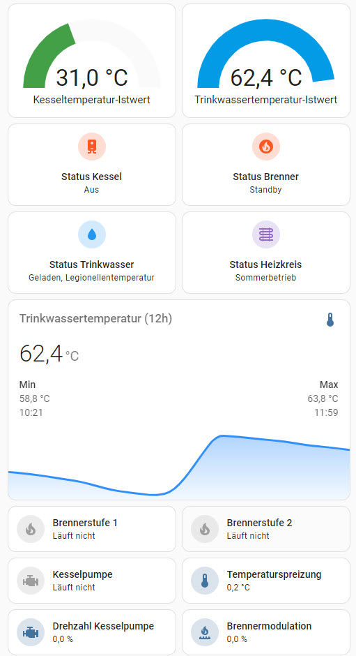
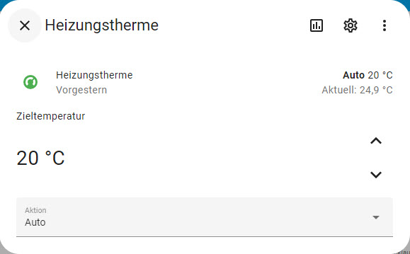
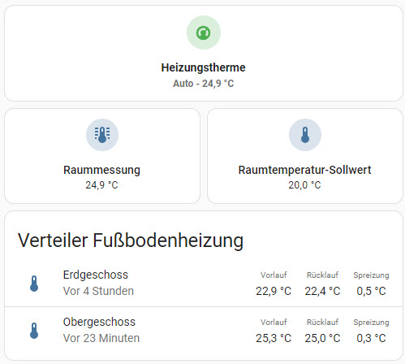
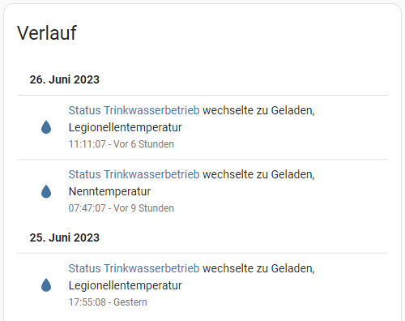
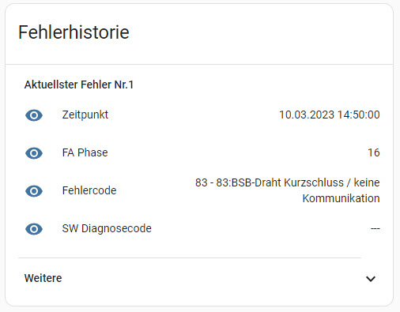
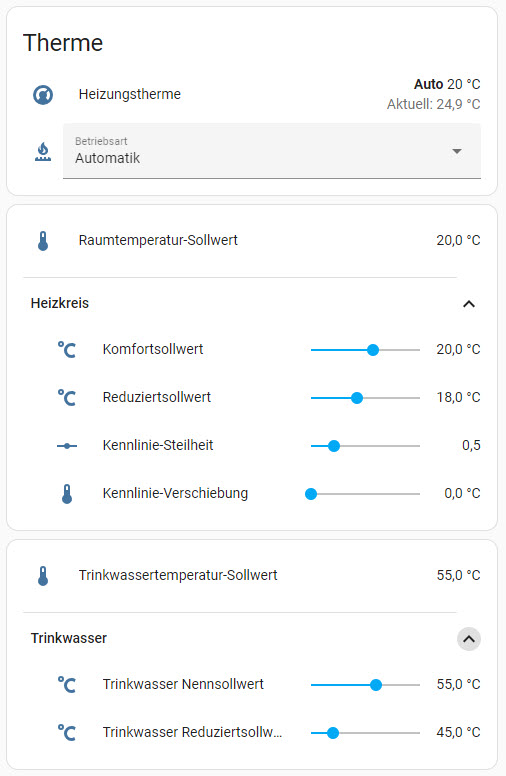
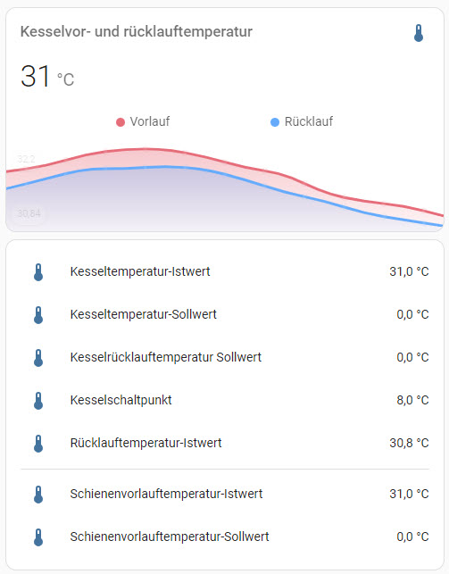
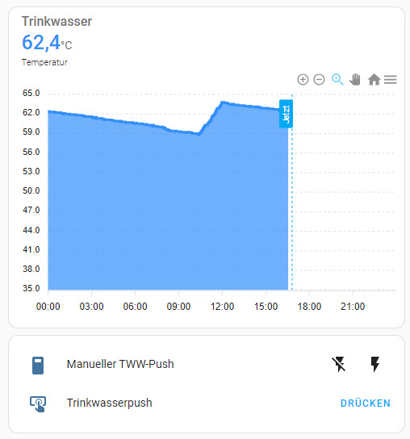

[Back to TOC](toc.md)  
[Back to chapter 7](chap07.md)    
   
---      
  
# 8. Integration via Additional Software  
  
***Note:  
The code examples and/or modules presented in the following subchapters may not yet have been adapted to the changes that accompanied the changeover of the BSB-LAN version to the v3.x. It may therefore be that some examples can no longer be adopted 1:1, but must be adapted (e.g.: the URL command /T isn't available anymore in BSB-LAN v3.x but can still be found in some examples listed below).  
If you should discover a code example or a module, which is not executable in the represented form with the current BSB-LAN version v3.x, then please inform the author of the example/module and (if possible) send me an adapted version of that example, so that I can place the corrected version here.  
Thanks.***
  
Because the adapter is just an interface which makes it possible to gain access to the controller of the heating system, it is of course possible to use external programs in addition to BSB-LAN. By this you can integrate your heating system in complex home automation systems and e.g. create comprehensive logfiles and realize their graphical output.  
   
Due to the many different software solutions out there, neither a comprehensive presentation, nor a comprehensive description about the integration in specific programs can be given here. Also the whole topic about heating systems in general and how to optimize their functionality can not be treated here.  
However, the following subchapters supported by kind users offer some example code and scripts for some common software solutions to show you how the integration of BSB-LAN works. Hopefully this will be helpful for your first steps.  
   
If any question about these example scripts arises, please try to find the answer by yourself (e.g. in a specific forum). Maybe the author of the specific example may also be willing to help you, so you can try to contact him, but please don't send me (Ulf) any questions about these topics.  
   
If you are a programmer or a user of a system which isn't already mentioned here and you want to contribute an example script to make the first steps easier for other users, of course you can contact me by email!

*At this point, there's just one advise I'd like to give you: always make sure, that the whole process of heat generation and the whole functionality of your heating system will still work without any problems in the case that your home automation system may be faulty or without functionality at all! Every intervention you may want to trigger with this system should not have any impact on the basic functionality of your heating system. Keep in mind that it's (in most of the cases) still a certain kind of controlled explosion and a burning process which generates the heat!*  
   
***Notes:***  
*Of course the following examples always have to be adjusted to your individual needs and settings. Especially the correct IP, probably activated security options and the setting that gives BSB-LAN writeable access should be mentioned here (see [chapter 5](chap05.md) for the specific options).*  
    
    
---
    
## 8.1 FHEM
<!---
---
    
### 8.1.1 Integration via BSB-LAN Module  
***FHEM forum member „justme1968" is working on a module for an easy integration in FHEM:  
[https://forum.fhem.de/index.php/topic,84381.0.html](https://forum.fhem.de/index.php/topic,84381.0.html)  
Vielen Dank!***

UPDATE:  
A first version is already available, but it's limited in functionality and probably not yet fully stable. If you are using FHEM, it's maybe better to use an implemention method like HTTPMOD until the module is completely done.  
   

    
### 8.1.2 Integration via HTTPMOD Module  
--->
***The following example scripts for the FHEM integration using HTTPMOD were contributed by FHEM forum member „freetz".  
Thanks a lot!***

To gain access to the adapter via FHEM, you can use the module HTTPMOD.

***Example script for the query of parameters and the transmission of the room temperature:***

The example script queries the parameters 8700, 8743 and 8314 every 300 seconds. It assigns them to the device \"THISION\" (name of the heating system) and the readings \"Aussentemperatur\",
\"Vorlauftemperatur\" und \"Ruecklauftemperatur\".
 
Furthermore it provides a reading \"Istwert\" which can be set via FHEM to transmit the current room temperature to the heating system (parameter 10000).  
  
Last but not least it calculates the difference between \"Vorlauftemperatur\" and \"Rücklauftemperatur\" and assigns this difference to the reading \"Spreizung\".

***Please note:***  
*The RegEx-conditions must match from the beginning of the string (therefore the number of the parameter, e.g. 8700).*  
  
*There seems to be a problem within the HTTPMOD-module and readings which start with "0" (`reading0Name` and `reading0Regex`), so please start the readings counting from "1".*
    
```
define THISION HTTPMOD http://192.168.178.88/8700/8743/8314 300
attr THISION userattr reading1Name reading1Regex reading2Name reading2Regex reading3Name reading3Regex readingOExpr set1Name set1URL
attr THISION event-on-change-reading .*
attr THISION reading1Name Aussentemperatur
attr THISION reading1Regex 8700 .*:[ \t]+([-]?[\d\.]+)
attr THISION reading2Name Vorlauftemperatur
attr THISION reading2Regex 8743 .*:[ \t]+([-]?[\d\.]+)
attr THISION reading3Name Ruecklauftemperatur
attr THISION reading3Regex 8314 .*:[ \t]+([-]?[\d\.]+)
attr THISION readingOExpr $val=~s/[\r\n]//g;;$val
attr THISION set1Name Istwert
attr THISION set1URL http://192.168.178.88/I10000=$val
attr THISION timeout 5
attr THISION userReadings Spreizung { sprintf("%.1f",ReadingsVal("THISION","Vorlauftemperatur",0)-ReadingsVal("THISION","Ruecklauftemperatur",0));; }
```  
    
With that example the readings are displayed as numerical values. If you want them to be displayed in plain text like it's done within the webinterface of BSB-LAN, you have to adjust the regular expressions according to that. The following example shows for the parameters '700 - Betriebsart' and '8000 - Staus Heizkreis 1'.   
    
```
attr THISION reading4Name Betriebsart
attr THISION reading4Regex 700 .*-[ \t]+(.*)
attr THISION reading5Name Status Heizkreis 1
attr THISION reading5Regex 8000 .*-[ \t]+(.*)
```
    
The numbering of the previously listed readings are continued with this, the readings should be added to the line 'attr THISION userattr'.  
Furthermore the URL has to be expanded with the parameters 700 and 8000.
At the end it looks like this:  
    
```
define THISION HTTPMOD http://192.168.178.88/8700/8743/8314/700/8000 300
attr THISION userattr reading1Name reading1Regex reading2Name reading2Regex reading3Name reading3Regex reading4Name reading4Regex reading5Name reading5Regex readingOExpr set1Name set1URL
attr THISION event-on-change-reading .*
attr THISION reading1Name Aussentemperatur
attr THISION reading1Regex 8700 .*:[ \t]+([-]?[\d\.]+)
attr THISION reading2Name Vorlauftemperatur
attr THISION reading2Regex 8743 .*:[ \t]+([-]?[\d\.]+)
attr THISION reading3Name Ruecklauftemperatur
attr THISION reading3Regex 8314 .*:[ \t]+([-]?[\d\.]+)
attr THISION reading4Name Betriebsart
attr THISION reading4Regex 700 .*-[ \t]+(.*)
attr THISION reading5Name Status Heizkreis 1
attr THISION reading5Regex 8000 .*-[ \t]+(.*)
attr THISION readingOExpr $val=~s/[\r\n]//g;;$val
attr THISION set1Name Istwert
attr THISION set1URL http://192.168.178.88/I10000=$val
attr THISION timeout 5
attr THISION userReadings Spreizung { sprintf("%.1f",ReadingsVal("THISION","Vorlauftemperatur",0)-ReadingsVal("THISION","Ruecklauftemperatur",0));; }
```
    
    
***Example script for the query and control of a connected relay board:***

The following script is an example for a FHEM configuration, where the three relay ports named \"Heater\", \"Fan\" and \"Bell\" are queried and controlled, with the relays connected to the GPIO pins 7, 6 and 5.  
    
```
define EthRelais HTTPMOD http://192.168.178.88/G05/G06/G07 30
attr EthRelais userattr reading1Name reading1Regex reading2Name reading2Regex reading3Name reading3Regex readingOExpr readingOMap set1Name set1URL set2Name set2URL set3Name set3URL setIMap setParseResponse:0,1 setRegex
attr EthRelais event-on-change-reading .*
attr EthRelais reading1Name Heater
attr EthRelais reading1Regex GPIO7:[ \t](\d)
attr EthRelais reading2Name Fan
attr EthRelais reading2Regex GPIO6:[ \t](\d)
attr EthRelais reading3Name Bell
attr EthRelais reading3Regex GPIO5:[ \t](\d)
attr EthRelais room Heizung
attr EthRelais set1Name Heater
attr EthRelais set1URL http://192.168.178.88/G07=$val
attr EthRelais set2Name Fan
attr EthRelais set2URL http://192.168.178.88/G06=$val
attr EthRelais set3Name Bell
attr EthRelais set3URL http://192.168.178.88/G05=$val
attr EthRelais setParseResponse 1
attr EthRelais setRegex GPIO[0-9]+:[ \t](\d)
attr EthRelais timeout 5
```
    
---
    

## 8.2 openHAB
  
When using openHAB >v2.5.4, you can implement BSB-LAN using the specific binding - for openHAB versions earlier than v2.5.4 there doesn't exist a binding. With these older versions you have to use e.g. the bindings for HTTPMOD and Javascript Transformation to read and set parameters.  
Logging can be realized by (e.g.) InfluxDB and visualisation by (e.g.) Grafana.   
  
---  
### 8.2.1 openHAB-Binding
   
***BSB-LAN user „hypetsch“ developed a [binding for openHAB](https://www.openhab.org/addons/bindings/bsblan/), which is officially part of openHAB since v2.5.4!***  
***Thanks a lot!***
   
   
---
  
### 8.2.2 openHAB with Javascript Transformation
  
***The example scripts for the openHAB integration were contributed by FHEM forum member „acfischer42". Based on that, user "sihui" contributed two corrections/suggestions for a change and the script to display the values in a sitemap.   
Thanks a lot!***

*NOTE:*  
The neccessary addons like the the Javascript Transformations have to be installed previously!  

***Example of an item configuration:***  
    
```
Number hz_aussentemp "Aussentemperatur [%.1f °C]" <temperature> (Heizunglog) { http="<[http://192.168.178.88/8700:60000:JS(bsbinput.js)]" }
String hz_700 "Heizkreis 1 Betriebsart [%s]" <temperature> (Heizunglog){ http="<[http://192.168.178.88/700:1000:JS(bsbinput_string.js)]" }
```
    
The following Javascript has to be put as *bsbinput.js* in the folder *transform*. 

***Example script for the query of parameters which report a value (bsbinput.js):***  
    
```javascript
(function(i) {
    var outputres;
	var results = [];
	value1 = i;
	// define regex to search for the line in the http response
	var regEx = 'input type=text id=\'value[0-9]+\' VALUE=\'[-]*[0-9]+\.[0-9]+';
	var re = new RegExp(regEx, 'gim');
  
 do {
    match = re.exec(value1);
    if (match){
        results.push(match[0]);
    }
} while (match);
    
	outputres = results[0]
	//extract actual value from the output
	var output=outputres.substr(outputres.indexOf("VALUE='")+7,outputres.length);
	return output;
})(input)
```
    
***Example script for a direct query of enum-values (bsbinput_string.js):***  
    
```javascript
(function(i) {
        var outputres;
	var results = [];
	value1 = i;
	// define regex to search for the line in the http response
	var regEx = '<option value=\'[0-9]+\' SELECTED>.*</option>';
	var re = new RegExp(regEx, 'gim');
  
 do {
    match = re.exec(value1);
    if (match){
        results.push(match[0]);
    }
} while (match);
    
	outputres = results[0]
	//extract actual value from the output
	var l=outputres.indexOf("</o")-outputres.indexOf(">")-1
	var output=outputres.substr(outputres.indexOf(">")+1,l);
		return output;
})(input)
```
    
***Writing data is done via rules:***  
    
```
rule "RoomTemp"

when
	Item iSet_temp changed
then
	sendHttpGetRequest("http://192.168.178.88/I10000="+iSet_temp.state.toString)
end
```  
    
***Display of values in a sitemap (BasicUI, ClassicUI, iOS und Android App):***  

```
sitemap demo label="Mein BSB LAN" {
    Frame label="Heizung" {
		Text item=hz_aussentemp
		Text item=hz_700
    }
}
```  
    
---
    
### 8.2.3 openHAB with Javascript Transformation, MQTT, Network and Expire
***Based on the previous example, FHEM forum member „sihui" (GitHub: [sihui62](https://github.com/sihui62)) wrote an expanded example.  
Thanks a lot!***  
   
*NOTE:*  
The neccessary addons like the the Javascript Transformation, MQTT, Network and Expire have to be installed previously!  
   
***The following example is shown as a sitemap in BasicUI like in the following screenshot:***

  
  
  
***Example of an item configuration (/items/bsblan.items):***  
    
```
Number hz_mode_cmd <heating> //change heating mode
String hz_mode_state <heating> { http="<[http://192.168.178.88/700:10000:JS(bsbinput_string.js)]" } //read heating mode from BSB LAN Adapter
Number hz_temperature_cmd <temperature> //change target temperature
Number hz_temperature_state <temperature> { http="<[http://192.168.178.88/8741:15000:JS(bsbinput.js)]" } //read current target temperature from BSB LAN Adapter
String hz_status <heating> { http="<[http://192.168.178.88/8000:20000:JS(bsbinput_string.js)]" } //read current heating status from BSB LAN Adapter
String hz_status_water <water> { http="<[http://192.168.178.88/8003:25000:JS(bsbinput_string.js)]" } //read current hot water status from BSB LAN Adapter
Switch hz_mode_komfort <switch> { expire="1s,command=OFF" } //ONLY if Parameter 48 is available on your controller: set temporary Komfort state during Automatik mode, switch item to OFF after one second (momentary switch)
Switch hz_mode_reduziert <switch> { expire="1s,command=OFF" } //ONLY if Parameter 48 is available on your controller: set temporary Reduziert state during Automatik mode, switch item to OFF after one second (momentary switch)
Number hz_temperature_rgt <temperature> { http="<[http://192.168.178.88/8740:25000:JS(bsbinput.js)]" } //read current room temperature for remote RGT from BSB LAN Adapter
Number hz_fan_speed <fan> { http="<[http://192.168.178.88/8323:30000:JS(bsbinput.js)]" } //read current fan speed from BSB LAN Adapter
Number hz_aussentemp <temperature> { http="<[http://192.168.178.88/8700:20000:JS(bsbinput.js)]" } //read current outside temperature from BSB LAN Adapter via Javascript Transformation (not used here)
Number hz_kitchen_maxActual "MAX! Küche [%.1f °C]" {channel="max:thermostat:KEQ0565026:KEQ0648949:actual_temp"} //read temperature from MAX!
Number BSBLAN_Aussentemp <temperature> { channel="mqtt:topic:bsblan:aussentemp" } //read current outside temperature from BSB LAN Adapter via MQTT2
Number BSBLAN_Vorlauftemp <temperature> { channel="mqtt:topic:bsblan:vorlauftemp" } //read current flow temperature from BSB LAN Adapter via MQTT2
Number BSBLAN_Ruecklauftemp <temperature> { channel="mqtt:topic:bsblan:ruecklauftemp" } //read current return temperature from BSB LAN Adapter via MQTT2
Switch bsb_lan_presence <presence> { channel="network:pingdevice:192_168_178_88:online" } //check online status of BSB LAN through Network binding
Number hz_mode_party <party> //enable or disable Party mode for 1-5 hours
```
    
The following Javascript has to be put as *bsbinput.js* in the folder *transform*.  

***Example script for the query of parameters which report a value (/transform/bsbinput.js):***  
     
```javascript
(function(i) {
    var outputres;
	var results = [];
	value1 = i;
	// define regex to search for the line in the http response
	var regEx = 'input type=text id=\'value[0-9]+\' VALUE=\'[-]*[0-9]+\.[0-9]+';
	var re = new RegExp(regEx, 'gim');
  
 do {
    match = re.exec(value1);
    if (match){
        results.push(match[0]);
    }
} while (match);
    
	outputres = results[0]
	//extract actual value from the output
	var output=outputres.substr(outputres.indexOf("VALUE='")+7,outputres.length);
	return output;
})(input)
```
    
***Example script for a direct query of enum-values (/transform/bsbinput_string.js):***  
    
```javascript
(function(i) {
        var outputres;
	var results = [];
	value1 = i;
	// define regex to search for the line in the http response
	var regEx = '<option value=\'[0-9]+\' SELECTED>.*</option>';
	var re = new RegExp(regEx, 'gim');
  
 do {
    match = re.exec(value1);
    if (match){
        results.push(match[0]);
    }
} while (match);
    
	outputres = results[0]
	//extract actual value from the output
	var l=outputres.indexOf("</o")-outputres.indexOf(">")-1
	var output=outputres.substr(outputres.indexOf(">")+1,l);
		return output;
})(input)
```
    
***Writing and reading data is done via rules (/rules/bsblan.rules):***  
    
```
var Timer PartyModeTimer = null //initialize a timer for party mode

rule "HeatingTempTarget" //change target temperature
when
	Item hz_temperature_cmd changed
then
	sendHttpGetRequest("http://192.168.178.88/S710="+hz_temperature_cmd.state.toString)
end

rule "HeatingMode" //change heating mode
when
	Item hz_mode_cmd changed
then
	sendHttpGetRequest("http://192.168.178.88/S700="+hz_mode_cmd.state.toString)
end

rule "UpdateHeatingMode" //reflect manual RGT remote changes on UI
when
	Item hz_mode_state changed
then
	hz_mode_cmd.postUpdate(transform("MAP","heatingmode.map",hz_mode_state.state.toString))
end

rule "SetModeKomfort" //set mode temporary to Komfort during Automatik mode
when
	Item hz_mode_komfort changed to ON
then
	sendHttpGetRequest("http://192.168.178.88/S701=0")
end

rule "SetModeReduziert" //set mode temporary to Reduziert during Automatik mode
when
	Item hz_mode_reduziert changed to ON
then
	sendHttpGetRequest("http://192.168.178.88/S701=1")
end

rule "SetPartyMode" //extends heating Komfort time for 1-5 hours
when
	Item hz_status changed
then
	// to do: read shutdown times for Absenkung Reduziert dynamically from BSB LAN Adapter
	if (hz_status.state.toString=="Absenkung Reduziert" && (now.getHourOfDay()>=22 && (now.getHourOfDay()<=23))) { //only trigger rule content during normal Reduziert shutdown times
		switch (hz_mode_party.state) {
				case 1: {
				if(PartyModeTimer!==null) {
           		PartyModeTimer.cancel
           		PartyModeTimer = null
        		}
					PartyModeTimer = createTimer(now.plusHours(1)) [ |
					hz_mode_cmd.sendCommand(1)
					logInfo("BSBLAN","Party Mode disabled")
					]
				hz_mode_cmd.sendCommand(3)
				hz_mode_party.postUpdate(0)
				logInfo("BSBLAN","Party Mode 1h")
				}		
				case 2: {
				if(PartyModeTimer!==null) {
           		PartyModeTimer.cancel
           		PartyModeTimer = null
        		}
					PartyModeTimer = createTimer(now.plusHours(2)) [ |
					hz_mode_cmd.sendCommand(1)
					logInfo("BSBLAN","Party Mode disabled")
					]
				hz_mode_cmd.sendCommand(3)
				hz_mode_party.postUpdate(0)
				logInfo("BSBLAN","Party Mode 2h")
				}
				case 3: {
				if(PartyModeTimer!==null) {
           		PartyModeTimer.cancel
           		PartyModeTimer = null
        		}
					PartyModeTimer = createTimer(now.plusHours(3)) [ |
					hz_mode_cmd.sendCommand(1)
					logInfo("BSBLAN","Party Mode disabled")
					]
				hz_mode_cmd.sendCommand(3)
				hz_mode_party.postUpdate(0)
				logInfo("BSBLAN","Party Mode 3h")
				}	
				case 4: {
				if(PartyModeTimer!==null) {
           		PartyModeTimer.cancel
           		PartyModeTimer = null
        		}
					PartyModeTimer = createTimer(now.plusHours(4)) [ |
					hz_mode_cmd.sendCommand(1)
					logInfo("BSBLAN","Party Mode disabled")
					]
				hz_mode_cmd.sendCommand(3)
				hz_mode_party.postUpdate(0)
				logInfo("BSBLAN","Party Mode 4h")
				}
				case 5: {
				if(PartyModeTimer!==null) {
           		PartyModeTimer.cancel
           		PartyModeTimer = null
        		}
					PartyModeTimer = createTimer(now.plusHours(5)) [ |
					hz_mode_cmd.sendCommand(1)
					logInfo("BSBLAN","Party Mode disabled")
					]
				hz_mode_cmd.sendCommand(3)
				hz_mode_party.postUpdate(0)
				logInfo("BSBLAN","Party Mode 5h")
				}
			}
	}
end

rule "ConsiderRoomTempFromKitchen" //feed external temperatures to controller, for example MAX!
when
	Item hz_kitchen_maxActual changed
then
	sendHttpGetRequest("http://192.168.178.88/I10000="+hz_kitchen_maxActual.state.toString)
end
```  

***Transformation of number values to readable text (/transform/heatingmode.map):***  

```
Automatik=1
Reduziert=2
Komfort=3
Schutzbetrieb=0
```

***Display of the values in a sitemap (/sitemaps/bsblan.sitemap, e.g. for BasicUI, ClassicUI, iOS and Android App):***  

```
sitemap bsblan label="Mein BSB LAN"
{
Frame	{
			Text label="Heizung" icon="heating"
				{
				Text item=hz_mode_state label="IST Betriebsart [%s]"
				Selection item=hz_mode_cmd label="SOLL Betriebsart [%s]" mappings=[1="Automatik",3="Komfort",2="Reduziert"]
				Text item=hz_temperature_state label="Gesetzte Temperatur [%.1f °C]"
				Setpoint item=hz_temperature_cmd label="SOLL Temperatur [%.1f °C]" minValue=16 maxValue=24 step=0.5
				Text item=hz_status label="Status Heizung [%s]"
				Text item=hz_status_water label="Status Wasser [%s]"
				Switch item=hz_mode_komfort label="Präsenz Komfort"
				Switch item=hz_mode_reduziert label="Präsenz Reduziert"
				Selection item=hz_mode_party label="Partymodus [%s]" mappings=[0="Aus",1="1h",2="2h",3="3h",4="4h",5="5h"]
				Text item=hz_temperature_rgt label="Raumtemperatur RGT [%.1f °C]"
				Text item=hz_kitchen_maxActual label="MAX! Küche [%.1f °C]"
				Text item=BSBLAN_Aussentemp label="Aussentemperatur [%.1f °C]"
				Text item=BSBLAN_Vorlauftemp label="Vorlauftemperatur [%.1f °C]"
				Text item=BSBLAN_Ruecklauftemp label="Rücklauftemperatur [%.1f °C]"
				Text item=bsb_lan_presence label="BSB LAN Online Status [%s]"
				Text item=hz_fan_speed label="Gebläsedrehzahl [%d U/min]"
				}
		}
}
```  
  
---
   

   
    
## 8.3 HomeMatic (EQ3)
    
***The following example scripts are written by FHEM forum member „Bratmaxe".    
After that, the example scripts of "PaulM" are listed.  
Thanks a lot!***  
    
***Example script for a query:***  

There are only 6 parameters need to be set:  
CuxGeraetAbfrage = Device address of the CuxD execute device, which does the queries  
CuxGeraetLogging = Device address of the CuxD execute device, which does the logging (emptyr==deactivated)  
IPAdresseBSB = IP-address of the BSB-LPB-LAN-adapter  
Wort = Number of the desired parameter: e.g. outside temperature = 8700  
Variablename = Name of the system variable in the CCU  
Durchschnitt24h = true == Durchschnittswert 24h holen, false == aktuellen Wert holen  

It's not necessary to create a variable before, that's done by the script.  
The type of the variable (number, bool, value list) will be adjusted automatically to the queried parameter.  
    
```
! BSB-Adapter Wert abfragen by Bratmaxe
! 29.10.2018 - V0.1 - Erste Version

string CuxGeraetAbfrage = "CUX2801001:1"; ! GeräteAdresse des CuxD Execute Gerätes, welches die Abfragen ausführt
string CuxGeraetLogging = "CUX2801001:1"; ! GeräteAdresse des CuxD Execute Gerätes, welches das Logging ausführt, Leer ("") lassen, wenn kein Cuxd-Highcharts Logging gewünscht
string IPAdresseBSB = "192.168.178.100"; !IP_Adresse des BSB-Adapters
string Wort = "8700"; !Parameternummer: Beispiel Außentemperatur = 8700, Betriebsmodus = 700
string Variablename = "Wetter_Temperatur_Heizung"; ! Name der Systemvariable
boolean Durchschnitt24h = false; ! true = Durchschnittswert holen, false = aktuellen Wert holen - diese muss vorher in der BSB_lan_config.h konfiguriert wurden sein!!!

!!!!!!!!!!!!!!!!!!!!!!!!!!!!!!!!!!!!!!!!!!!!!!!!!!!!!!!!!!!!!!!!!!!!!!!!!!!!!!!!!!!!!!!!!
!!!!!!!!!!!!!!!!!!!!!!!Ab hier keine Anpassungen mehr notwendig!!!!!!!!!!!!!!!!!!!!!!!!!!
!!!!!!!!!!!!!!!!!!!!!!!!!!!!!!!!!!!!!!!!!!!!!!!!!!!!!!!!!!!!!!!!!!!!!!!!!!!!!!!!!!!!!!!!!

! URL Zusammenführen
string url="";
if (Durchschnitt24h) { url="http://" # IPAdresseBSB # "/A" # Wort; }
else { url="http://" # IPAdresseBSB # "/" # Wort; }
! Variable anlegen, wenn nicht vorhanden:
object svObject = dom.GetObject(Variablename);
object svObjectlist = dom.GetObject(ID_SYSTEM_VARIABLES);
if (!svObject)
{
    svObject = dom.CreateObject(OT_VARDP);
    svObjectlist.Add(svObject.ID());
	svObjectlist = dom.GetObject(ID_SYSTEM_VARIABLES);
    svObject.Name(Variablename);   
    svObject.Internal(false);
    svObject.Visible(true);
}

! Werte holen
dom.GetObject("CUxD." # CuxGeraetAbfrage # ".CMD_SETS").State("wget --tries=5 --timeout=20 --quiet --output-document=- '"# url #"'"); 
dom.GetObject("CUxD." # CuxGeraetAbfrage # ".CMD_QUERY_RET").State(1);
var stdout = dom.GetObject("CUxD." # CuxGeraetAbfrage # ".CMD_RETS").State();

! Prüfe, ob eine Ausgabe vorhanden ist, sonst z.B. IP-Adresse falsch, oder Netzwerkfehler
if (stdout != null && stdout != "")
{
	! Ausgabe filtern
	integer pos = (stdout.Find(Wort# " "));	
	if (pos == -1)
	{
		WriteLine("Position vom Wort '" # Wort # "' konnte nicht ermittelt werden");
	}
	
	stdout = stdout.Substr(pos, stdout.Length());
	pos = stdout.Find("/td");
	stdout = stdout.Substr(0, pos);
	
	! Sonderzeichen ersetzen
	if (stdout.Contains("&deg;")){ stdout = stdout.Replace("&deg;","°"); }
	if (stdout.Contains("&#037;")){ stdout = stdout.Replace("&#037;","%"); }
	stdout = stdout.ToLatin();
	!WriteLine("Nach Sonderzeichenumwandlung: " # stdout); !Debug: Welchen Wert hat stdout aktuell

	! Systemvariabel Info ermitteln
	string Info = stdout.Substr(0,stdout.Find(":"));
	!Info = Info.Substr(Wort.Length(), stdout.Length()); !Parameterzahl vor der Info entfernen
	!WriteLine("DPInfo = " # Info); !Debug: Welcher DPInfo-Wert wurde gefunden
	
	! Systemvariabel Wert ermitteln
	string Wert = stdout.Substr(stdout.Find(": ") + 2,stdout.Length());
	Wert = Wert.Substr(0,Wert.Find(" "));
	!WriteLine("Wert = " # Wert); !Debug: Welcher Wert wurde gefunden

	! Systemvariabel Einheit ermitteln
	string Einheit = stdout.Substr(stdout.Find(Info) + Info.Length() + 1, stdout.Length());
	Einheit = Einheit.Substr(Einheit.Find(Wert) + Wert.Length() + 1,Einheit.Length());
	Einheit = Einheit.RTrim();
	if (Einheit.Contains("- "))	{ Einheit = ""; }
	!WriteLine("Einheit = " # Einheit); !Debug: Welche Einheit wurde gefunden

	! Systemvariable Typ und Werte setzen
	svObject.DPInfo(Info);
	svObject.ValueUnit(Einheit);
	
	! Enums des Parameters ermitteln, wenn vorhanden
	url="http://" # IPAdresseBSB # "/E" # Wort;

	dom.GetObject("CUxD." # CuxGeraetAbfrage # ".CMD_SETS").State("wget --tries=5 --timeout=20 --quiet --output-document=- '"# url #"'"); 
	dom.GetObject("CUxD." # CuxGeraetAbfrage # ".CMD_QUERY_RET").State(1);
	stdout = dom.GetObject("CUxD." # CuxGeraetAbfrage # ".CMD_RETS").State();
	! Prüfe, ob es sich um einen Parameter mit Enum-Werten handelt.
	if (!stdout.Contains("FEHLER: Falscher Typ!"))
	{
		! Setzen des Systemvariabel Wertetyp und Ermitteln der Enum-Werte des Parameters
		stdout = (stdout.Substr(stdout.Find("0 - "), stdout.Length())).ToLatin();
		string value = "";
		string newvalues = "";
		integer inewvalues=0;
		foreach (value, stdout.Split("\r"))
		{
			if (value.Contains(" - "))
			{
				if (newvalues == "") { newvalues = newvalues # value.Substr(value.Find(" - ") + 3,value.Length()); }
				else { newvalues = newvalues # ";" # value.Substr(value.Find(" - ") + 3,value.Length()); }
				inewvalues = inewvalues + 1;
			}
		}
		
		svObject.ValueType(ivtInteger);
		svObject.ValueSubType(istEnum);
		svObject.ValueList(newvalues);
		!prüft, ob der ermittelte Wert innerhalbe der möglichen Werte liegt
		if (Wert < inewvalues) { if (Wert != svObject.Value()) { svObject.State(Wert); } }
		else { WriteLine("Der ermittelte Wert entspricht keinem gültigen Enum-Wert. Bitte Ausgabe prüfen!") }
	}
	elseif (Einheit.Contains("- Aus") || Einheit.Contains("- Ein"))
	{
		! Setzen des Systemvariabel Wertetyp
		svObject.ValueType(ivtBinary);
		svObject.ValueSubType(istBool);
		svObject.ValueName0("Aus");
		svObject.ValueName1("Ein");
		if (Wert != svObject.Value()) {	svObject.State(Wert); }
	}
	elseif (Einheit.Contains("°"))
	{
		! Setzen des Systemvariabel Wertetyp
		svObject.ValueType(ivtFloat);
		svObject.ValueSubType(istGeneric);
		svObject.ValueMin(-50);
		svObject.ValueMax(100);
		if (Wert != svObject.Value()) {	svObject.State(Wert); }
	}
	elseif (Einheit.Contains("%"))
	{
		! Setzen des Systemvariabel Wertetyp
		svObject.ValueType(ivtFloat);
		svObject.ValueSubType(istGeneric);
		svObject.ValueMin(0);
		svObject.ValueMax(100);
		if (Wert != svObject.Value()) {	svObject.State(Wert); }
	}
	else
	{
		! Setzen des Systemvariabel Wertetyp
		svObject.ValueType(ivtFloat);
		svObject.ValueSubType(istGeneric);
		if (Wert != svObject.Value()) {	svObject.State(Wert); }
	}
	dom.RTUpdate(0); ! Interne Aktualisierung der Systemvariabelen

	! Logging
	if (CuxGeraetLogging != "")	{ dom.GetObject("CUxD."#CuxGeraetLogging#".LOGIT").State(dom.GetObject(ID_SYSTEM_VARIABLES).Get(Variablename).Name()#";"#dom.GetObject(ID_SYSTEM_VARIABLES).Get(Variablename).Value());	}
}

```
    
***Script for setting parameters:***  

Create a program where all system variables that should be observed are associated with ODER and bigger than or equal with 0 and "bei Aktualisierung auslösen" (triggered by actualisation).  
Example: 
   
```
WENN Variablename größer oder gleich 0 "bei Aktualisierung auslösen"
DANN Dieses SKRIPT sofort ausführen
```
    
This variable need to include the value of the parameter in the info first (will be named by the read-out-script from above automatically). Example: 700 heating circuit 1 - operating mode  
The number of the parameter will be detected automatically from the system variable 'Info'.  
If the variable will be changed, the changed value will be send and actualized to the adapter automatically!  
    
```
! BSB-Adapter Wert setzen by Bratmaxe
! 29.10.2018 - V0.1 - Erste Version

! Funktionsbeschreibung:
! Ein Programm, wo alle Systemvariabeln die Überwacht werden sollen mit ODER Verknüpft und größer oder gleich 0 und  "bei Aktualisierung auslösen" , anlegen.
! Beispiel:
! WENN Variablename größer oder gleich 0 "bei Aktualisierung auslösen"
! DANN Dieses SKRIPT sofort ausführen
! die Variable muss in der Info zuerst den Parameter-Wert enthalten (wird von meinem Auslese Skript automatisch so benannt. Beispiel: 700 Heizkreis 1 - Betriebsart
! Die Parameternummer wird dann automatisch aus der Systemvariable Info ermittelt.
! Wird die Variable geändert, so wird der geänderte Wert automatisch an den BSB-Adapter übermittelt und aktualisiert!

string CuxGeraetSetzen = "CUX2801001:12"; ! GeräteAdresse des CuxD Execute Gerätes
string IPAdresseBSB = "192.168.2.200"; !IP_Adresse des BSB-Adapters

!!!!!!!!!!!!!!!!!!!!!!!!!!!!!!!!!!!!!!!!!!!!!!!!!!!!!!!!!!!!!!!!!!!!!!!!!!!!!!!!!!!!!!!!!
!!!!!!!!!!!!!!!!!!!!!!!Ab hier keine Anpassungen mehr notwendig!!!!!!!!!!!!!!!!!!!!!!!!!!
!!!!!!!!!!!!!!!!!!!!!!!!!!!!!!!!!!!!!!!!!!!!!!!!!!!!!!!!!!!!!!!!!!!!!!!!!!!!!!!!!!!!!!!!!

! Hole Auslösende Variabel
var source = dom.GetObject("$src$"); !Funktioniert nur beim automatischen Aufruf
! Zum manuellen Aufruf/testen nächste Zeile einkommentieren
!source = dom.GetObject(ID_SYSTEM_VARIABLES).Get("VARIABLENAMEN");

if (source)
{
	! Wort ermitteln
	string Wort = source.DPInfo().ToString().Substr(0,source.DPInfo().Find(" "));
	!WriteLine("Wort: "#Wort);
	if (Wort != null && Wort != "")
	{		
		string Wert = source.Value().ToString();
		!WriteLine("Wert: "#Wert);
		if (Wert != null && Wert != "")
		{
			! Anweisung senden
			string urlset="http://" # IPAdresseBSB # "/S" # Wort # "=" # Wert;
			dom.GetObject("CUxD." # CuxGeraetSetzen # ".CMD_SETS").State("wget -t 5 -T 20 -q -O - '"# urlset #"'");
			dom.GetObject("CUxD." # CuxGeraetSetzen # ".CMD_QUERY_RET").State(1);
			var stdout = dom.GetObject("CUxD." # CuxGeraetSetzen # ".CMD_RETS").State();
			if (stdout != null && stdout != "")
			{
				if (stdout.Contains("FEHLER: "))
				{
					stdout = stdout.Substr(stdout.Find("FEHLER: "), stdout.Length());
					stdout = stdout.Substr(0, stdout.Find("/td"));
					WriteLine("Fehlermeldung: "# stdout);
					WriteLine("Wurde der BSB-Adapter zum Schreiben berechtigt? Handbuch Seite 26 beachten...");
				}
				else
				{
					! Kontrollabfrage
					string url="http://" # IPAdresseBSB # "/" # Wort;
					dom.GetObject("CUxD." # CuxGeraetSetzen # ".CMD_SETS").State("wget -t 5 -T 20 -q -O - '"# url #"'");
					dom.GetObject("CUxD." # CuxGeraetSetzen # ".CMD_QUERY_RET").State(1);
					stdout = dom.GetObject("CUxD." # CuxGeraetSetzen # ".CMD_RETS").State();

					! Ausgabe filtern
					integer pos = (stdout.Find("tr  td \r\n" # Wort # " ") + 9);
					stdout = stdout.Substr(pos, stdout.Length());
					pos = stdout.Find("/td");
					stdout = stdout.Substr(0, pos);
					
					! Sonderzeichen ersetzen
					if (stdout.Contains("&deg;")){ stdout = stdout.Replace("&deg;","°"); }
					if (stdout.Contains("&#037;")){ stdout = stdout.Replace("&#037;","%"); }
					!WriteLine("Nach Sonderzeichenumwandlung: " # stdout); !Debug: Welchen Wert hat stdout aktuell
					
					! Systemvariabel oldWert ermitteln
					string oldWert = stdout.Substr(stdout.Find(": ") + 2,stdout.Length());
					oldWert = oldWert.Substr(0,oldWert.Find(" "));
					!WriteLine("oldWert = " # oldWert.ToFloat()); !Debug: Welcher oldWert wurde gefunden
					!WriteLine("newWert = " # Wert.ToFloat()); !Debug: Welcher oldWert wurde gefunden
					
					if (Wert.ToFloat() != oldWert.ToFloat()) { WriteLine("Fehler: Werte stimmen nach setzen nicht überein!"); }	
					else { WriteLine("Wert wurde erfolgreich gesetzt");	}
				}
			}
			else { WriteLine("Keine Ausgabe gefunden. IP-Adresse und Verkabelung prüfen.");	}
		}
		else { WriteLine("Der neue Wert konnte nicht ermittelt werden.");	}
	}
	else { WriteLine("Wort konnte nicht ermittelt werden, Steht der Wert in der SystemvariableInfo am Anfang gefolgt von einem Leerzeichen?");	}
}
else { WriteLine("Auslösende Variable nicht erkannt! - Skript wird nicht ausgeführt.");	}

```
    
***Query of the errors of the controller to realize a notification if an error occurs:***  
    
```
! BSB-Adapter Wert abfragen Fehlercodes by Bratmaxe
! 05.11.2018 - V0.1 - Erste Version

string CuxGeraetAbfrage = "CUX2801001:1"; ! GeräteAdresse des CuxD Execute Gerätes, welches die Abfragen ausführt
string IPAdresseBSB = "192.168.178.100"; !IP_Adresse des BSB-Adapters
string Variablename = "Heizung_Fehlercodes"; ! Name der Systemvariable
integer AnzahlFehler = 10;

!!!!!!!!!!!!!!!!!!!!!!!!!!!!!!!!!!!!!!!!!!!!!!!!!!!!!!!!!!!!!!!!!!!!!!!!!!!!!!!!!!!!!!!!!
!!!!!!!!!!!!!!!!!!!!!!!Ab hier keine Anpassungen mehr notwendig!!!!!!!!!!!!!!!!!!!!!!!!!!
!!!!!!!!!!!!!!!!!!!!!!!!!!!!!!!!!!!!!!!!!!!!!!!!!!!!!!!!!!!!!!!!!!!!!!!!!!!!!!!!!!!!!!!!!

! Parameter Zusammenbauen
integer i =0;
string Woerter ="";
while (i < AnzahlFehler)
{
	if (Woerter != "")
	{
		Woerter = Woerter + "," + ((6801) + (10 * i)).ToString();
	}
	else { Woerter = Woerter + ((6801) + (10 * i)).ToString(); }
	i = i + 1;
}

! URL Zusammenführen
string Ergebnis = "";
string Wort = "";

foreach(Wort, Woerter.Split(","))
{
	string url="http://" # IPAdresseBSB # "/" # ((Wort.ToInteger() - 1).ToString());
	
	! Werte holen
	dom.GetObject("CUxD." # CuxGeraetAbfrage # ".CMD_SETS").State("wget --tries=5 --timeout=20 --quiet --output-document=- '"# url #"'"); 
	dom.GetObject("CUxD." # CuxGeraetAbfrage # ".CMD_QUERY_RET").State(1);
	var stdout = dom.GetObject("CUxD." # CuxGeraetAbfrage # ".CMD_RETS").State();
	
	! Prüfe, ob eine Ausgabe vorhanden ist, sonst z.B. IP-Adresse falsch, oder Netzwerkfehler
	if (stdout != null && stdout != "")
	{
		! Ausgabe filtern
		integer pos = (stdout.Find((Wort.ToInteger() - 1).ToString() #  " "));	
		stdout = stdout.Substr(pos, stdout.Length());
		pos = stdout.Find("/td");
		stdout = stdout.Substr(0, pos);
		
		! Sonderzeichen ersetzen
		if (stdout.Contains("°")){ stdout = stdout.Replace("°","°"); }
		if (stdout.Contains("%")){ stdout = stdout.Replace("%","%"); }
		stdout = stdout.ToLatin();
		Ergebnis = Ergebnis # stdout.RTrim() # "\n\r";
	}

	url="http://" # IPAdresseBSB # "/" # Wort;	
	dom.GetObject("CUxD." # CuxGeraetAbfrage # ".CMD_SETS").State("wget --tries=5 --timeout=20 --quiet --output-document=- '"# url #"'"); 
	dom.GetObject("CUxD." # CuxGeraetAbfrage # ".CMD_QUERY_RET").State(1);
	stdout = dom.GetObject("CUxD." # CuxGeraetAbfrage # ".CMD_RETS").State();

	! Prüfe, ob eine Ausgabe vorhanden ist, sonst z.B. IP-Adresse falsch, oder Netzwerkfehler
	if (stdout != null && stdout != "")
	{
		! Ausgabe filtern
		integer pos = (stdout.Find(Wort# " "));	
		stdout = stdout.Substr(pos, stdout.Length());
		pos = stdout.Find("/td");
		stdout = stdout.Substr(0, pos);
		
		! Sonderzeichen ersetzen
		if (stdout.Contains("°")){ stdout = stdout.Replace("°","°"); }
		if (stdout.Contains("%")){ stdout = stdout.Replace("%","%"); }
		stdout = stdout.ToLatin();
		Ergebnis = Ergebnis # stdout.RTrim() # "\n\r\n\r";
	}
}

!Wenn noch keine Systemvarible vorhanden, diese anlegen
object svObject = dom.GetObject(Variablename);
object svObjectlist = dom.GetObject(ID_SYSTEM_VARIABLES);
if (!svObject)
{   
    svObjectlist = dom.GetObject(ID_SYSTEM_VARIABLES);
    svObject = dom.CreateObject(OT_VARDP);
    svObjectlist.Add(svObject.ID());
    svObject.Name(Variablename);   
    svObject.ValueType(ivtString);
    svObject.ValueSubType(istChar8859);
    svObject.DPInfo("Die letzen 20 Fehlercodes der Heizung");
    svObject.Internal(false);
    svObject.Visible(true);
    dom.RTUpdate(0);
}

if (Ergebnis.ToLatin() != svObject.Value().ToLatin()) { svObject.State(Ergebnis); }
```  
    
***Query of parameters and additionally connected DS18B20 temperature sensors, using the specific sensor ids and the query of /T:***
```
! BSB-Adapter Wert abfragen by Bratmaxe
! 29.10.2018 - V0.1 - Erste Version
! 11.11.2019 - V0.2 - Auslesen von Temperatursensoren hinzugefügt
! 15.11.2019 - V0.3 - Änderung der Ausleseart der Temperatursensoren mithilfe der ID 

string CuxGeraetAbfrage = "CUX2801001:11"; ! GeräteAdresse des CuxD Execute Gerätes, welches die Abfragen ausführt
string CuxGeraetLogging = "CUX2801001:10"; ! GeräteAdresse des CuxD Execute Gerätes, welches das Logging ausführt, Leer ("") lassen, wenn kein Cuxd-Highcharts Logging gewünscht
string IPAdresseBSB = "192.168.178.88"; !IP_Adresse des BSB-Adapters
string Wort = "T"; !Parameternummer: Beispiel Außentemperatur = 8700, Betriebsmodus = 700, eigene Temperatursensoren = T
string TemperatursensorID = "28aa44085414010b"; !Wenn Wort = "T", dann hier die ID des auszulesenden Temperatursensors eingeben, wird sonst ignoriert!
string Variablename = "Wetter_Temperatur"; ! Name der Systemvariable
boolean Durchschnitt24h = false; ! true = Durchschnittswert holen, false = aktuellen Wert holen - diese muss vorher in der BSB_lan_config.h konfiguriert wurden sein!!! (Bei Wort = T wird dieser Parameter ignoriert)

!!!!!!!!!!!!!!!!!!!!!!!!!!!!!!!!!!!!!!!!!!!!!!!!!!!!!!!!!!!!!!!!!!!!!!!!!!!!!!!!!!!!!!!!!
!!!!!!!!!!!!!!!!!!!!!!!Ab hier keine Anpassungen mehr notwendig!!!!!!!!!!!!!!!!!!!!!!!!!!
!!!!!!!!!!!!!!!!!!!!!!!!!!!!!!!!!!!!!!!!!!!!!!!!!!!!!!!!!!!!!!!!!!!!!!!!!!!!!!!!!!!!!!!!!

! URL Zusammenführen
string url="";
if (Durchschnitt24h && Wort != "T") 
{ 
	url="http://" # IPAdresseBSB # "/A" # Wort; 
}
else 
{ 
	url="http://" # IPAdresseBSB # "/" # Wort; 
}

! Variable anlegen, wenn nicht vorhanden:
object svObject = dom.GetObject(Variablename);
object svObjectlist = dom.GetObject(ID_SYSTEM_VARIABLES);
if (!svObject)
{
    svObject = dom.CreateObject(OT_VARDP);
    svObjectlist.Add(svObject.ID());
	svObjectlist = dom.GetObject(ID_SYSTEM_VARIABLES);
    svObject.Name(Variablename);   
    svObject.Internal(false);
    svObject.Visible(true);
}

! Werte holen
dom.GetObject("CUxD." # CuxGeraetAbfrage # ".CMD_SETS").State("wget --tries=5 --timeout=20 --quiet --output-document=- '"# url #"'");  
dom.GetObject("CUxD." # CuxGeraetAbfrage # ".CMD_QUERY_RET").State(1);
var stdout = dom.GetObject("CUxD." # CuxGeraetAbfrage # ".CMD_RETS").State();

! Prüfe, ob eine Ausgabe vorhanden ist, sonst z.B. IP-Adresse falsch, oder Netzwerkfehler
if (stdout != null && stdout != "")
{
	integer pos = (stdout.Find(Wort# " "));	
	
	! Ausgabe filtern
	if (Wort == "T")
	{
		pos = (stdout.Find(TemperatursensorID # ": "));	
	}

	if (pos == -1)
	{
		WriteLine("Position vom Wort '" # Wort # "' konnte nicht ermittelt werden");
	}
	
	stdout = stdout.Substr(pos, stdout.Length());
	pos = stdout.Find("/td");
	stdout = stdout.Substr(0, pos);
	
	! Sonderzeichen ersetzen
	if (stdout.Contains("&deg;")){ stdout = stdout.Replace("&deg;","°"); } !& d e g ; ohne Leerzeichen
	if (stdout.Contains("%")){ stdout = stdout.Replace("%","%"); } !& # 0 3 7 ; ohne Leerzeichen
	!WriteLine("Nach Sonderzeichenumwandlung: " # stdout); !Debug: Welchen Wert hat stdout aktuell

	! Systemvariabel Info ermitteln
	string Info = "";
	if (Wort == "T")
	{
		Info = "SensorID: " + TemperatursensorID;
	}
	else
	{
		Info = stdout.Substr(0,stdout.Find(":"));
	}
	!Info = Info.Substr(Wort.Length(), stdout.Length());
	!WriteLine("DPInfo = " # Info); !Debug: Welcher DPInfo-Wert wurde gefunden
	
	! Systemvariabel Wert ermitteln
	string Wert = stdout.Substr(stdout.Find(": ") + 2,stdout.Length());
	Wert = Wert.Substr(0,Wert.Find(" "));
	!WriteLine("Wert = " # Wert); !Debug: Welcher Wert wurde gefunden

	! Systemvariabel Einheit ermitteln
	string Einheit = stdout.Substr(stdout.Find(Info) + Info.Length() + 1, stdout.Length());
	Einheit = Einheit.Substr(Einheit.Find(Wert) + Wert.Length() + 1,Einheit.Length());
	Einheit = Einheit.RTrim();
	if (Einheit.Contains("- "))	{ Einheit = ""; }
	!WriteLine("Einheit = " # Einheit); !Debug: Welche Einheit wurde gefunden

	! Systemvariable Typ und Werte setzen
	svObject.DPInfo(Info);
	svObject.ValueUnit(Einheit);
	
	! Enums des Parameters ermitteln, wenn vorhanden
	url="http://" # IPAdresseBSB # "/E" # Wort;

	dom.GetObject("CUxD." # CuxGeraetAbfrage # ".CMD_SETS").State("wget --tries=5 --timeout=20 --quiet --output-document=- '"# url #"'");  
	dom.GetObject("CUxD." # CuxGeraetAbfrage # ".CMD_QUERY_RET").State(1);
	stdout = dom.GetObject("CUxD." # CuxGeraetAbfrage # ".CMD_RETS").State();
	! Prüfe, ob es sich um einen Parameter mit Enum-Werten handelt.
	if (!stdout.Contains("FEHLER: Falscher Typ!"))
	{
		! Setzen des Systemvariabel Wertetyp und Ermitteln der Enum-Werte des Parameters
		stdout = (stdout.Substr(stdout.Find("0 - "), stdout.Length())).ToLatin();
		string value = "";
		string newvalues = "";
		integer inewvalues=0;
		foreach (value, stdout.Split("\r"))
		{
			if (value.Contains(" - "))
			{
				if (newvalues == "") { newvalues = newvalues # value.Substr(value.Find(" - ") + 3,value.Length()); }
				else { newvalues = newvalues # ";" # value.Substr(value.Find(" - ") + 3,value.Length()); }
				inewvalues = inewvalues + 1;
			}
		}
		
		svObject.ValueType(ivtInteger);
		svObject.ValueSubType(istEnum);
		svObject.ValueList(newvalues);
		!prüft, ob der ermittelte Wert innerhalbe der möglichen Werte liegt
		if (Wert < inewvalues) { if (Wert != svObject.Value()) { if (Wert != "") { svObject.State(Wert); }} }
		else { WriteLine("Der ermittelte Wert entspricht keinem gültigen Enum-Wert. Bitte Ausgabe prüfen!") }
	}
	elseif (Einheit.Contains("- Aus") || Einheit.Contains("- Ein"))
	{ 
		! Setzen des Systemvariabel Wertetyp
		svObject.ValueType(ivtBinary);
		svObject.ValueSubType(istBool);
		svObject.ValueName0("Aus");
		svObject.ValueName1("Ein");
		if (Wert != svObject.Value()) {	if (Wert != "") { svObject.State(Wert); } }
	}
	elseif (Einheit.Contains("°"))
	{ 
		! Setzen des Systemvariabel Wertetyp
		svObject.ValueType(ivtFloat);
		svObject.ValueSubType(istGeneric);
		svObject.ValueMin(-50);
		svObject.ValueMax(100);
		if (Wert != svObject.Value()) {	if (Wert != "") { svObject.State(Wert); } }
	}
	elseif (Einheit.Contains("%"))
	{ 
		! Setzen des Systemvariabel Wertetyp
		svObject.ValueType(ivtFloat);
		svObject.ValueSubType(istGeneric);
		svObject.ValueMin(0);
		svObject.ValueMax(100);
		if (Wert != svObject.Value()) {	if (Wert != "") { svObject.State(Wert); } }
	}
	else
	{ 
		! Setzen des Systemvariabel Wertetyp
		svObject.ValueType(ivtFloat);
		svObject.ValueSubType(istGeneric);
		if (Wert != svObject.Value()) {	if (Wert != "") { svObject.State(Wert); } }
	}
	dom.RTUpdate(0); ! Interne Aktualisierung der Systemvariabelen

	! Logging
	if (CuxGeraetLogging != "")	{ dom.GetObject("CUxD."#CuxGeraetLogging#".LOGIT").State(dom.GetObject(ID_SYSTEM_VARIABLES).Get(Variablename).Name()#";"#dom.GetObject(ID_SYSTEM_VARIABLES).Get(Variablename).Value());	}
}
```  

    
---    
    
***The following HomeMatic-scripts are developed by FHEM forum member „PaulM".  
Thanks a lot!***  
    
For implementation in HomeMatic the usage of CuxD and wget is a good option.  

***Example for the query of the parameter '8326 burner modulation' by using CuxD:***  
    
```
! Skriptanfang:
! BSB-Abfrage
string url='http://192.168.178.88/8326'; !IP anpassen
! WriteLine("URL: " # url); !nur Kontrolle
! --timeout=seconds  ! während der Dauer der Abfrage werden von der CCU 
! keine anderen Skripte ausgeführt !!! 
! siehe CUxD-Handbuch 5.8.2 System.Exec
! dom.GetObject("CUxD.CUX2801001:1.CMD_SETS").State
! ("wget -t 5 -T 20 -q -O - '"# url #"'");  ! abgekürzte Wget Syntax
dom.GetObject("CUxD.CUX2801001:1.CMD_SETS").State("wget --tries=5 --timeout=20 --quiet --output-document=- '"# url #"'");  
! ausführliche Wget Syntax
dom.GetObject("CUxD.CUX2801001:1.CMD_QUERY_RET").State(1);
var stdout = dom.GetObject("CUxD.CUX2801001:1.CMD_RETS").State();
! WriteLine("Antwort: " # stdout);
! Beim stdout den ueberfluessigen Vorspann entfernen
integer laenge = stdout.Length();
integer pos = stdout.Find("body"); 
! ab hier kommen auswertbare Informationen
pos = pos + 10;
stdout = stdout.Substr(pos, (laenge - pos));
! wenn Rückmeldung mit allen Daten angezeigt werden soll, 
! Ausrufezeichen nächste Zeile entfernen
! WriteLine("Antwort ohne Vorspann: " # stdout);
string wort = "8326"; !Brennermodulation
integer laenge = wort.Length();
! WriteLine("laenge: " # laenge); zum Testen für andere Parameter 
! für Skripttest Ausrufezeichen entfernen
integer pos = stdout.Find(wort);
! WriteLine("pos:" #pos);
pos = pos + 39; !bei anderen Parametern meist zwischen 25 und 50
string daten = stdout.Substr((pos + laenge +1), 100);
! WriteLine("daten :"#daten);
integer pos = daten.Find(wort);
daten = daten.Substr(0, (pos));
integer zahl = daten.ToFloat();
! keine Prüfung, da auch 0 sein kann
dom.GetObject("H_Brennermodulation").State(zahl);
WriteLine("H_Brennermodulation: "#zahl);
! nur für Chart CUxD
dom.GetObject("CUxD.CUX2801001:1.LOGIT").State
("H_Brennermodulation"#";"#zahl);
WriteLine("Hallo Welt!");
! Skriptende:
```
    
***Example for setting the mode to comfort with ‚S700=3'
using CuxD:***  
    
```
! Skriptanfang:
! Heizung KOMFORT (=AN - keine Nachtabsenkung)
! Anweisung senden
string urlset ='http://192.168.178.88/S700=3'; !IP anpassen
WriteLine("Befehl: " # urlset);
dom.GetObject("CUxD.CUX2801001:1.CMD_SETS").State
("wget -t 5 -T 20 -q -O - '"# urlset #"'");
dom.GetObject("CUxD.CUX2801001:1.CMD_QUERY_RET").State(1);
var stdout = dom.GetObject("CUxD.CUX2801001:1.CMD_RETS").State();
! Kontrollabfrage
string url='http://192.168.178.88/700'; !IP anpassen
! WriteLine("URL: " # url);
dom.GetObject("CUxD.CUX2801001:1.CMD_SETS").State
("wget -t 5 -T 20 -q -O - '"# url #"'");
dom.GetObject("CUxD.CUX2801001:1.CMD_QUERY_RET").State(1);
var stdout = dom.GetObject("CUxD.CUX2801001:1.CMD_RETS").State();
! WriteLine("Antwort: " # stdout);
! Beim stdout den ueberfluessigen Vorspann entfernen
integer laenge = stdout.Length();
integer pos = stdout.Find("body");
pos = pos + 10;
stdout = stdout.Substr(pos, (laenge - pos));
! wenn Rückmeldung mit allen Daten angezeigt werden soll, 
! Ausrufezeichen nächste Zeile entfernen
! WriteLine("Antwort ohne Vorspann: " # stdout);
string wort = "700"; !Heizbetrieb
integer laenge = wort.Length();
! WriteLine("laenge: " # laenge);
integer pos = stdout.Find(wort);
! WriteLine("pos:" #pos);
pos = pos + 28;
! WriteLine("pos: " # pos);	
string daten = stdout.Substr((pos + laenge +1), 100);
! WriteLine("daten :"#daten);
string substring = daten.Substr(0, 1);
integer zahl = substring.ToInteger();
WriteLine("aktueller Heizbetrieb (0 bis 3): " # zahl);
if (zahl == 0) {dom.GetObject('H_Heizbetrieb').State("Heizung AUS");}
if (zahl == 1) {dom.GetObject('H_Heizbetrieb').State("Heizung Automatik");}
if (zahl == 2) {dom.GetObject('H_Heizbetrieb').State("Heizung Nachtabsenkung");}
if (zahl == 3) {dom.GetObject('H_Heizbetrieb').State("Heizung Komfort");}
! nur für Chart CUxD 
!dom.GetObject("CUxD.CUX2801001:1.LOGIT").State("H_Heizbetrieb"#";"#zahl);	
! alle Werte aktualisieren
var programObj = dom.GetObject("Heizungswerte abfragen"); 
! Programmnamen ggf. anpassen
programObj.ProgramExecute();
WriteLine("Hallo Welt!");
! Skriptende:
```

***Query and save as a system variable:***  
Vacation mode from-to / setback level (632/633/648)  
Heating and hot water operation (700/1600/8700/8326/8743/8314/8830)  
Transfer of the room temperature measured by a One-Wire sensor to the BOD (I10000)  
Logging (for evaluations with CUxD Highcharts)  
    
```
!Heizung Abfrage V17 mit CUxD 2018-02-17

!wget mit ausführl. Syntax 2018-02-17
!inkl. Daten Ferienbetrieb und -niveau 2018-01-31

!Prüfung of Rückgabewerte ungleich Null
!auch senden an CUxD-Geräte Tempsens_H_*

!H_Trinkwassertemperatur korrigiert +1.3  2017-08-11
!mit Übertrag der Raumtemperatur an die Heizung Parameter 8740 2017-05-13
!mit OneWire Sensoren 2017-04-26

!als Systemvariablen sind in Homematic angelegt:
!H_Ferien_Beginn Zeichenkette
!H_Ferien_Ende Zeichenkette
!H_Ferienniveau Zeichenkette

!H_Aussentemperatur	Zahl
!H_Brennermodulation	Zahl
!H_Vorlauftemperatur	Zahl
!H_Kesselruecklauftemperatur	Zahl
!H_Trinkwassertemperatur	Zahl
!H_Heizbetrieb 	Zeichenkette
!H_Trinkwasserbetrieb	Zeichenkette

!632	Beginn Ferienbetrieb	TT.MM
!633	Ende Ferienbetrieb	TT.MM 
!648  Frostschutz / Reduziert

string url='http://192.168.10.13/632/633/648/700/1600/8700/8326/8743/8314/8830/T';

!WriteLine("URL: " # url);

!--timeout=seconds  ! während der Dauer der Abfrage werden von der CCU keine anderen Skripte ausgeführt 
! CUxD-Handbuch 5.8.2 System.Exec "Es ist zu beachten, dass die Verarbeitung des HM-Scripts erst fortgesetzt wird, nachdem das aufgerufene Programm beendet wurde. Während dieser Zeit werden keine anderen HM-Scripts ausgeführt!"

!dom.GetObject("CUxD.CUX2801001:1.CMD_SETS").State("wget -t 30 -q -O - '"# url #"'");  ! abgekürzte Wget Syntax
dom.GetObject("CUxD.CUX2801001:1.CMD_SETS").State("wget --tries=5 --timeout=20 --quiet --output-document=- '"# url #"'");  ! ausführliche Wget Syntax
dom.GetObject("CUxD.CUX2801001:1.CMD_QUERY_RET").State(1);          
var stdout = dom.GetObject("CUxD.CUX2801001:1.CMD_RETS").State(); 
!WriteLine("Antwort: " # stdout);

!Beim stdout den ueberfluessigen Vorspann entfernen
	integer laenge = stdout.Length();
	integer pos = stdout.Find("body");
	pos = pos + 10;
	stdout = stdout.Substr(pos, (laenge - pos));
	!wenn Rückmeldung mit allen Daten angezeigt werden soll, Ausrufezeichen nächste Zeile entfernen
	!WriteLine("Antwort ohne Vorspann: " # stdout);

string wort = "632"; !Ferien Heizkreis 1 Beginn TT.MM
	integer laenge = wort.Length();
	!WriteLine("laenge: " # laenge);
	integer pos = stdout.Find(wort);
	!WriteLine("pos:" #pos);
	pos = pos + 48;
	!WriteLine("pos: " # pos);	
	string daten = stdout.Substr((pos + laenge +1), 13);
	daten = daten.Substr(2,5);
	!WriteLine("daten :"#daten);
	dom.GetObject('H_Ferien_Beginn').State("Ferien ab: ???"); ! setzt vorherigen Wert zurück
	dom.GetObject('H_Ferien_Beginn').State("Ferien ab: "# daten);
	var temp = dom.GetObject('H_Ferien_Beginn').Value();
	WriteLine("Ferien Heizkreis 1 Beginn TT.MM: " # temp);	
	
string wort = "633"; !Ferien Heizkreis 1 Ende TT.MM
	integer laenge = wort.Length();
	!WriteLine("laenge: " # laenge);
	integer pos = stdout.Find(wort);
	!WriteLine("pos:" #pos);
	pos = pos + 48;
	!WriteLine("pos: " # pos);	
	string daten = stdout.Substr((pos + laenge +1), 15);
	daten = daten.Substr(0,5);
	!WriteLine("daten :"#daten);
	dom.GetObject('H_Ferien_Ende').State("Ferien bis: ???"); ! setzt vorherigen Wert zurück
	dom.GetObject('H_Ferien_Ende').State("Ferien bis: "# daten);
	var temp = dom.GetObject('H_Ferien_Ende').Value();
	WriteLine("Ferien Heizkreis 1 Ende TT.MM: " # temp);	
	
string wort = "648"; !Betriebsniveau Ferien
	integer laenge = wort.Length();
	!WriteLine("laenge: " # laenge);
	integer pos = stdout.Find(wort);
	!WriteLine("pos:" #pos);
	pos = pos + 48;
	!WriteLine("pos: " # pos);	
	string daten = stdout.Substr((pos + laenge +1), 15);
	daten = daten.Substr(0,12);
	!WriteLine("daten :"#daten);
	dom.GetObject('H_Ferienniveau').State("Ferienniveau: ???"); ! setzt vorherigen Wert zurück
	dom.GetObject('H_Ferienniveau').State("Ferienniveau: "# daten);
	var temp = dom.GetObject('H_Ferienniveau').Value();
	WriteLine("Betriebsniveau Ferien: " # temp);
	
	
string wort = "700"; !Heizbetrieb
	integer laenge = wort.Length();
	!WriteLine("laenge: " # laenge);
	integer pos = stdout.Find(wort);
	!WriteLine("pos:" #pos);
	pos = pos + 28;
	!WriteLine("pos: " # pos);	
	string daten = stdout.Substr((pos + laenge +1), 100);
	!WriteLine("daten :"#daten);
	string substring = daten.Substr(0, 1);
	integer zahl = substring.ToInteger();
	!WriteLine("zahl: " # zahl);
		if (zahl == 0) {dom.GetObject('H_Heizbetrieb').State("Heizung AUS");}
		if (zahl == 1) {dom.GetObject('H_Heizbetrieb').State("Heizung Automatik");}
		if (zahl == 2) {dom.GetObject('H_Heizbetrieb').State("Heizung Nachtabsenkung");}
		if (zahl == 3) {dom.GetObject('H_Heizbetrieb').State("Heizung Komfort");}
		
! nur für Chart CUxD 
!dom.GetObject("CUxD.CUX2801001:1.LOGIT").State("H_Heizbetrieb"#";"#zahl);


string wort = "1600"; !Trinkwasserbetrieb
	integer laenge = wort.Length();
	!WriteLine("laenge: " # laenge);
	integer pos = stdout.Find(wort);
	!WriteLine("pos:" #pos);
	pos = pos + 35;
	string daten = stdout.Substr((pos + laenge +1), 100);
	!WriteLine("daten :"#daten);
	string substring = daten.Substr(0, 1);
	integer zahl = substring.ToInteger();
	!WriteLine("zahl: " # zahl);
		if (zahl == 0) {dom.GetObject('H_Trinkwasserbetrieb').State("Warmwasserbetrieb - AUS");}
		if (zahl == 1) {dom.GetObject('H_Trinkwasserbetrieb').State("Warmwasserbetrieb - EIN");}

	! nur für Chart CUxD 
!dom.GetObject("CUxD.CUX2801001:1.LOGIT").State("H_Trinkwasserbetrieb"#";"#zahl);


string wort = "8700"; !Aussentemperatur
	integer laenge = wort.Length();
	!WriteLine("laenge: " # laenge);
	integer pos = stdout.Find(wort);
	!WriteLine("pos:" #pos);
	pos = pos + 41;
	string daten = stdout.Substr((pos + laenge +1), 100);
	!WriteLine("daten :"#daten);
	integer pos = daten.Find(wort);
	daten = daten.Substr(0, (pos));
	integer zahl = daten.ToFloat();
	!Korrektur des angezeigten Wertes auf das Niveau der übrige Thermometer
	if (zahl<>0)
		{
		zahl = zahl - 3.5;
		dom.GetObject("H_Aussentemperatur").State(zahl);
		WriteLine("H_Aussentemperatur: "#zahl); 

		! nur für Chart CUxD 
		dom.GetObject("CUxD.CUX2801001:1.LOGIT").State("H_Aussentemperatur"#";"#zahl);

		! für CUxD Gerät Tempsens_H_Aussen
		dom.GetObject("CUxD.CUX9002012:1.SET_TEMPERATURE").State(zahl);	
		}
	
string wort = "8326"; !Brennermodulation
	integer laenge = wort.Length();
	!WriteLine("laenge: " # laenge);
	integer pos = stdout.Find(wort);
	!WriteLine("pos:" #pos);
	pos = pos + 39;;
	string daten = stdout.Substr((pos + laenge +1), 100);
	!WriteLine("daten :"#daten);
	integer pos = daten.Find(wort);
	daten = daten.Substr(0, (pos));
	integer zahl = daten.ToFloat();
	!keine Prüfung, da auch 0 sein kann
	dom.GetObject("H_Brennermodulation").State(zahl);
	WriteLine("H_Brennermodulation: "#zahl); 

	! nur für Chart CUxD 
	dom.GetObject("CUxD.CUX2801001:1.LOGIT").State("H_Brennermodulation"#";"#zahl);

string wort = "8743"; !Vorlauftemperatur 1:
	integer laenge = wort.Length();
	!WriteLine("laenge: " # laenge);
	integer pos = stdout.Find(wort);
	!WriteLine("pos:" #pos);
	pos = pos + 45;
	string daten = stdout.Substr((pos + laenge +1), 100);
	!WriteLine("daten :"#daten);
	integer pos = daten.Find(wort);
	daten = daten.Substr(0, (pos));
	integer zahl = daten.ToFloat();
	if (zahl<>0)
		{
		dom.GetObject("H_Vorlauftemperatur").State(zahl);
		WriteLine("H_Vorlauftemperatur: "#zahl); 

		! nur für Chart CUxD 
		dom.GetObject("CUxD.CUX2801001:1.LOGIT").State("H_Vorlauftemperatur"#";"#zahl);

		! für CUxD Gerät Tempsens_H_KesselVor
		dom.GetObject("CUxD.CUX9002014:1.SET_TEMPERATURE").State(zahl);	
		}
		
string wort = "8314"; !Kesselrücklauftemperatur
	integer laenge = wort.Length();
	!WriteLine("laenge: " # laenge);
	integer pos = stdout.Find(wort);
	!WriteLine("pos:" #pos);
	pos = pos + 52;
	string daten = stdout.Substr((pos + laenge +1), 100);
	!WriteLine("daten :"#daten);
	integer pos = daten.Find(wort);
	daten = daten.Substr(0, (pos));
	integer zahl = daten.ToFloat();
	if (zahl<>0)
		{	
		dom.GetObject("H_Kesselruecklauftemperatur").State(zahl);
		WriteLine("H_Kesselruecklauftemperatur: "#zahl); 

		! nur für Chart CUxD 
		dom.GetObject("CUxD.CUX2801001:1.LOGIT").State("H_Kesselruecklauftemperatur"#";"#zahl);

		! für CUxD Gerät Tempsens_H_KesselRue
		dom.GetObject("CUxD.CUX9002013:1.SET_TEMPERATURE").State(zahl);	
		}
		
string wort = "8830"; !Trinkwassertemperatur
	integer laenge = wort.Length();
	!WriteLine("laenge: " # laenge);
	integer pos = stdout.Find(wort);
	!WriteLine("pos:" #pos);
	pos = pos + 48;
	string daten = stdout.Substr((pos + laenge +1), 100);
	!WriteLine("daten :"#daten);
	integer pos = daten.Find(wort);
	daten = daten.Substr(0, (pos));
	integer zahl = daten.ToFloat();
	!Korrektur relativ zur Kesselvorlauftemperatur
	if (zahl<>0)
		{	
		zahl = zahl + 1.3;
		dom.GetObject("H_Trinkwassertemperatur").State(zahl);
		WriteLine("H_Trinkwassertemperatur "#zahl); 

		! nur für Chart CUxD 
		dom.GetObject("CUxD.CUX2801001:1.LOGIT").State("H_Trinkwassertemperatur"#";"#zahl);

		! für CUxD Gerät Tempsens_H_Trinkw
		dom.GetObject("CUxD.CUX9002015:1.SET_TEMPERATURE").State(zahl);	
		}

!Übertrag der Raumtemperatur Esszimmer  ...4d6 an die Heizung als Parameter 8740

	real temp = dom.GetObject("T_Innentemperatur_Esszimmer").Value();
	temp = temp.ToString();

	string urlset = 'http://192.168.10.13/I10000='# temp;
	!WriteLine("url " # urlset);

	dom.GetObject("CUxD.CUX2801001:1.CMD_SETS").State("wget -t 30 -q -O - '"# urlset #"'");   
	dom.GetObject("CUxD.CUX2801001:1.CMD_QUERY_RET").State(1);          
	var stdout = dom.GetObject("CUxD.CUX2801001:1.CMD_RETS").State(); 
	!WriteLine("stdout: " # stdout);
	
	!Abfrage, ob Setzen des Wertes ok  
	string url='http://192.168.10.13/8740';

	dom.GetObject("CUxD.CUX2801001:1.CMD_SETS").State("wget -t 30 -q -O - '"# url #"'");   
	dom.GetObject("CUxD.CUX2801001:1.CMD_QUERY_RET").State(1);          
	var stdout = dom.GetObject("CUxD.CUX2801001:1.CMD_RETS").State(); 
	!WriteLine("stdout: " # stdout);

	string wort = "8740"; !Raumtemperatur 1
	integer laenge = wort.Length();
	!WriteLine("laenge: " # laenge);
	integer pos = stdout.Find(wort);
	!WriteLine("pos:" #pos);
	pos = pos + 42;
	string daten = stdout.Substr((pos + laenge +1), 5);
	!WriteLine("daten :"#daten);
	integer pos = daten.Find(wort);
	daten = daten.Substr(0, (pos));
	!integer zahl = daten.ToFloat();
	WriteLine("an die Heizung übertragene Raumtemperatur (8740) "#daten #"°C"); 

WriteLine("Hallo Welt!");
```
    
***Commands to change the mode of the heater:***  
So that syntax-safe instructions can be given from CCU to BSB (important e.g. also if no direct access to the BSB adapter is possible via VPN).  

*Heating OFF (= frost protection mode):*  
    
```
!Heizung AUS (=Frostschutzbetrieb)  2017-03-09

string urlset ='http://192.168.10.13/S700=0';
WriteLine("Befehl: " # urlset);

dom.GetObject("CUxD.CUX2801001:1.CMD_SETS").State("wget -t 30 -q -O - '"# urlset #"'");   
dom.GetObject("CUxD.CUX2801001:1.CMD_QUERY_RET").State(1);          
var stdout = dom.GetObject("CUxD.CUX2801001:1.CMD_RETS").State(); 

string url='http://192.168.10.13/700';

WriteLine("URL: " # url);

!--timeout=seconds

dom.GetObject("CUxD.CUX2801001:1.CMD_SETS").State("wget -t 30 -q -O - '"# url #"'");   
dom.GetObject("CUxD.CUX2801001:1.CMD_QUERY_RET").State(1);          
var stdout = dom.GetObject("CUxD.CUX2801001:1.CMD_RETS").State(); 
WriteLine("Antwort: " # stdout);

!Beim stdout den ueberfluessigen Vorspann entfernen
	integer laenge = stdout.Length();
	integer pos = stdout.Find("body");
	pos = pos + 10;
	stdout = stdout.Substr(pos, (laenge - pos));
	!wenn Rückmeldung mit allen Daten angezeigt werden soll, Ausrufezeichen nächste Zeile entfernen
	
!Werte aktualisieren
var programObj = dom.GetObject("Heizungswerte abfragen");
programObj.ProgramExecute();	
	
	WriteLine("Antwort ohne Vorspann: " # stdout);
WriteLine("Hallo Welt!");
```  
    
*Heating automatic (= ON - with night setback):*  
```
!Heizung Automatik (=AN - mit Nachtabsenkung)  2017-03-09

!http://192.168.10.13/Passwort/S700=0 (Schutzbetrieb)
!http://192.168.10.13/Passwort/S700=1 (Automatik)
!http://192.168.10.13/Passwort/S700=2 (Reduziert)
!http://192.168.10.13/Passwort/S700=3 (Komfort)

string urlset ='http://192.168.10.13/S700=1';
WriteLine("Befehl: " # urlset);

dom.GetObject("CUxD.CUX2801001:1.CMD_SETS").State("wget -t 30 -q -O - '"# urlset #"'");   
dom.GetObject("CUxD.CUX2801001:1.CMD_QUERY_RET").State(1);          
var stdout = dom.GetObject("CUxD.CUX2801001:1.CMD_RETS").State(); 

string url='http://192.168.10.13/700';

WriteLine("URL: " # url);

!--timeout=seconds

dom.GetObject("CUxD.CUX2801001:1.CMD_SETS").State("wget -t 30 -q -O - '"# url #"'");   
dom.GetObject("CUxD.CUX2801001:1.CMD_QUERY_RET").State(1);          
var stdout = dom.GetObject("CUxD.CUX2801001:1.CMD_RETS").State(); 
WriteLine("Antwort: " # stdout);

!Beim stdout den ueberfluessigen Vorspann entfernen
	integer laenge = stdout.Length();
	integer pos = stdout.Find("body");
	pos = pos + 10;
	stdout = stdout.Substr(pos, (laenge - pos));
	!wenn Rückmeldung mit allen Daten angezeigt werden soll, Ausrufezeichen nächste Zeile entfernen
	WriteLine("Antwort ohne Vorspann: " # stdout);

!Werte aktualisieren
var programObj = dom.GetObject("Heizungswerte abfragen");
programObj.ProgramExecute();	
	
WriteLine("Hallo Welt!");
```
    
*Heating COMFORT (= ON - no night setback)*:  
```
!Heizung KOMFORT (=AN - keine Nachtabsenkung)  2017-03-09

!http://192.168.10.13/Passwort/S700=0 (Schutzbetrieb)
!http://192.168.10.13/Passwort/S700=1 (Automatik)
!http://192.168.10.13/Passwort/S700=2 (Reduziert)
!http://192.168.10.13/Passwort/S700=3 (Komfort)

! Anweisung senden
string urlset ='http://192.168.10.13/S700=3';
WriteLine("Befehl: " # urlset);

dom.GetObject("CUxD.CUX2801001:1.CMD_SETS").State("wget -t 30 -q -O - '"# urlset #"'");   
dom.GetObject("CUxD.CUX2801001:1.CMD_QUERY_RET").State(1);          
var stdout = dom.GetObject("CUxD.CUX2801001:1.CMD_RETS").State(); 

! Kontrollabfrage
string url='http://192.168.10.13/700';

WriteLine("URL: " # url);

!--timeout=seconds

dom.GetObject("CUxD.CUX2801001:1.CMD_SETS").State("wget -t 30 -q -O - '"# url #"'");   
dom.GetObject("CUxD.CUX2801001:1.CMD_QUERY_RET").State(1);          
var stdout = dom.GetObject("CUxD.CUX2801001:1.CMD_RETS").State(); 
WriteLine("Antwort: " # stdout);

!Beim stdout den ueberfluessigen Vorspann entfernen
	integer laenge = stdout.Length();
	integer pos = stdout.Find("body");
	pos = pos + 10;
	stdout = stdout.Substr(pos, (laenge - pos));
	!wenn Rückmeldung mit allen Daten angezeigt werden soll, Ausrufezeichen nächste Zeile entfernen
	WriteLine("Antwort ohne Vorspann: " # stdout);
	
!alle Werte aktualisieren
var programObj = dom.GetObject("Heizungswerte abfragen");
programObj.ProgramExecute();	
	
WriteLine("Hallo Welt!");
```
    
*Heating REPLACEMENT (continuously, i.e. also during the day!):*  
```
!Heizung Nachtabsenkung (dauernd, d.h. auch tagsüber Nachtabsenkung)  2017-03-09

!http://192.168.10.13/Passwort/S700=0 (Schutzbetrieb)
!http://192.168.10.13/Passwort/S700=1 (Automatik)
!http://192.168.10.13/Passwort/S700=2 (Reduziert)
!http://192.168.10.13/Passwort/S700=3 (Komfort)


string urlset ='http://192.168.10.13/S700=2';
WriteLine("Befehl: " # urlset);

dom.GetObject("CUxD.CUX2801001:1.CMD_SETS").State("wget -t 30 -q -O - '"# urlset #"'");   
dom.GetObject("CUxD.CUX2801001:1.CMD_QUERY_RET").State(1);          
var stdout = dom.GetObject("CUxD.CUX2801001:1.CMD_RETS").State(); 

string url='http://192.168.10.13/700';

WriteLine("URL: " # url);

!--timeout=seconds

dom.GetObject("CUxD.CUX2801001:1.CMD_SETS").State("wget -t 30 -q -O - '"# url #"'");   
dom.GetObject("CUxD.CUX2801001:1.CMD_QUERY_RET").State(1);          
var stdout = dom.GetObject("CUxD.CUX2801001:1.CMD_RETS").State(); 
WriteLine("Antwort: " # stdout);

!Beim stdout den ueberfluessigen Vorspann entfernen
	integer laenge = stdout.Length();
	integer pos = stdout.Find("body");
	pos = pos + 10;
	stdout = stdout.Substr(pos, (laenge - pos));
	!wenn Rückmeldung mit allen Daten angezeigt werden soll, Ausrufezeichen nächste Zeile entfernen
	WriteLine("Antwort ohne Vorspann: " # stdout);
	
!Werte aktualisieren
var programObj = dom.GetObject("Heizungswerte abfragen");
programObj.ProgramExecute();	
	
WriteLine("Hallo Welt!");
```
    
***Query of the daily averages /A and saving it as a system variable:***  
    
```
!Heizung Abfrage Tagesdurchschnitte V5 2017-10-07

!Raumtemperatur Ist und Trinkwassertemperatur ergänzt
!Variablen reduziert

!als Systemvariablen sind in Homematic angelegt:
!H_Aussentemperatur_24h				Zahl	8700
!H_Brennermodulation_24h			Zahl	8326
!H_Vorlauftemperatur_24h			Zahl	8743
!H_Kesselruecklauftemperatur_24h	Zahl	8314

!H_Raumtemperatur_Ist_24h			Zahl	8740
!H_Raumtemperatur_Soll_24h  ???
!H_Trinkwassertemperatur_24h		Zahl	8830

string url='http://192.168.10.13/A';

WriteLine("URL: " # url);

!--timeout=seconds

dom.GetObject("CUxD.CUX2801001:1.CMD_SETS").State("wget -t 30 -qO- '"# url #"'");   
dom.GetObject("CUxD.CUX2801001:1.CMD_QUERY_RET").State(1);          
var stdout = dom.GetObject("CUxD.CUX2801001:1.CMD_RETS").State(); 
!WriteLine("Antwort: " # stdout);

!Beim stdout den ueberfluessigen Vorspann entfernen
	integer laenge = stdout.Length();
	integer pos = stdout.Find("body");
	pos = pos + 10;
	stdout = stdout.Substr(pos, (laenge - pos));
	!wenn Rückmeldung mit allen Daten angezeigt werden soll, Ausrufezeichen nächste Zeile entfernen
	WriteLine("Antwort ohne Vorspann: " # stdout);
	
!----------------------------------------------------------------------------

string wort = "8700"; !Aussentemperatur
	integer laenge = wort.Length();
	!WriteLine("laenge: " # laenge);
	integer pos = stdout.Find(wort);
	!WriteLine("pos:" #pos);
	pos = pos + 20;
	string daten = stdout.Substr((pos + laenge +1), 100);
	!WriteLine("daten :"#daten);
	integer pos = daten.Find(wort);
	daten = daten.Substr(0, (pos));
	integer zahl = daten.ToFloat();
	!Korrektur des angezeigten Wertes auf das Niveau der übrige Thermometer
	zahl = zahl - 3.5;
	dom.GetObject("H_Aussentemperatur_24h").State(zahl);
	WriteLine("H_Aussentemperatur_24h: "#zahl); 

! nur für Chart CUxD 
!dom.GetObject("CUxD.CUX2801001:1.LOGIT").State("H_Aussentemperatur_24h"#";"#zahl);

!----------------------------------------------------------------------------

string wort = "8326"; !Brennermodulation
	integer laenge = wort.Length();
	!WriteLine("laenge: " # laenge);
	integer pos = stdout.Find(wort);
	!WriteLine("pos:" #pos);
	pos = pos + 21;
	string daten = stdout.Substr((pos + laenge +1), 100);
	!WriteLine("daten :"#daten);
	integer pos = daten.Find(wort);
	daten = daten.Substr(0, (pos));
	integer zahl = daten.ToFloat();
	dom.GetObject("H_Brennermodulation_24h").State(zahl);
	WriteLine("H_Brennermodulation_24h: "#zahl); 

! nur für Chart CUxD 
!dom.GetObject("CUxD.CUX2801001:1.LOGIT").State("H_Brennermodulation_24h"#";"#zahl);

!----------------------------------------------------------------------------

string wort = "8743"; !Vorlauftemperatur 1:
	integer laenge = wort.Length();
	!WriteLine("laenge: " # laenge);
	integer pos = stdout.Find(wort);
	!WriteLine("pos:" #pos);
	pos = pos + 23;
	string daten = stdout.Substr((pos + laenge +1), 100);
	!WriteLine("daten :"#daten);
	integer pos = daten.Find(wort);
	!daten = daten.Substr(0, (pos));
	integer zahl = daten.ToFloat();
	dom.GetObject("H_Vorlauftemperatur_24h").State(zahl);
	WriteLine("H_Vorlauftemperatur_24h: "#zahl); 

! nur für Chart CUxD 
!dom.GetObject("CUxD.CUX2801001:1.LOGIT").State("H_Vorlauftemperatur_24h"#";"#zahl);

!----------------------------------------------------------------------------

string wort = "8314"; !Kesselrücklauftemperatur
	integer laenge = wort.Length();
	!WriteLine("laenge: " # laenge);
	integer pos = stdout.Find(wort);
	!WriteLine("pos:" #pos);
	pos = pos + 33;
	string daten = stdout.Substr((pos + laenge +1), 100);
	!WriteLine("daten :"#daten);
	integer pos = daten.Find(wort);
	daten = daten.Substr(0, (pos));
	integer zahl = daten.ToFloat();
	dom.GetObject("H_Kesselruecklauftemperatur_24h").State(zahl);
	WriteLine("H_Kesselruecklauftemperatur_24h: "#zahl); 

! nur für Chart CUxD 
!dom.GetObject("CUxD.CUX2801001:1.LOGIT").State("H_Kesselruecklauftemperatur_24h"#";"#zahl);

!----------------------------------------------------------------------------

string wort = "8740"; !Raumtemperatur 1
	integer laenge = wort.Length();
	!WriteLine("laenge: " # laenge);
	integer pos = stdout.Find(wort);
	!WriteLine("pos:" #pos);
	pos = pos + 21;
	string daten = stdout.Substr((pos + laenge +1), 100);
	!WriteLine("daten :"#daten);
	integer pos = daten.Find(wort);
	daten = daten.Substr(0, (pos));
	integer zahl = daten.ToFloat();
	dom.GetObject("H_Raumtemperatur_Ist_24h").State(zahl);
	WriteLine("H_Raumtemperatur_Ist_24h: "#zahl); 

! nur für Chart CUxD 
!dom.GetObject("CUxD.CUX2801001:1.LOGIT").State("H_Raumtemperatur_Ist_24h"#";"#zahl);

!----------------------------------------------------------------------------
string wort = "8830"; !Trinkwassertemperatur
	integer laenge = wort.Length();
	!WriteLine("laenge: " # laenge);
	integer pos = stdout.Find(wort);
	!WriteLine("pos:" #pos);
	pos = pos + 28;
	string daten = stdout.Substr((pos + laenge +1), 100);
	!WriteLine("daten :"#daten);
	integer pos = daten.Find(wort);
	daten = daten.Substr(0, (pos));
	integer zahl = daten.ToFloat();
	dom.GetObject("H_Trinkwassertemperatur_24h").State(zahl);
	WriteLine("H_Trinkwassertemperatur_24h: "#zahl); 

! nur für Chart CUxD 
!dom.GetObject("CUxD.CUX2801001:1.LOGIT").State("H_Trinkwassertemperatur_24h"#";"#zahl);


WriteLine("Hallo Welt!");
```
    
***Query connected DS18B20 temperature sensors and save the output as a system variable:***  
    
```
!Temperatursensoren Abfrage CUxD 2017-10-13 (Auszug)


!als Systemvariablen sind in Homematic angelegt:
!28ff99e890160456 T_Aussentemperatur_Nord
!28ffff85901604d6 T_Innentemperatur_Esszimmer	

string url='http://192.168.10.13/ipwe.cgi';

!WriteLine("URL: " # url);

!--timeout=seconds

dom.GetObject("CUxD.CUX2801001:1.CMD_SETS").State("wget -t 30 --timeout=20 -q -O - '"# url #"'");
dom.GetObject("CUxD.CUX2801001:1.CMD_QUERY_RET").State(1);          
var stdout = dom.GetObject("CUxD.CUX2801001:1.CMD_RETS").State(); 
!WriteLine("Antwort: " # stdout);

!Beim stdout den ueberfluessigen Vorspann entfernen
	integer laenge = stdout.Length();
	integer pos = stdout.Find("body");
	pos = pos + 10;
	stdout = stdout.Substr(pos, (laenge - pos));
	!wenn Rückmeldung mit allen Daten angezeigt werden soll, Ausrufezeichen nächste Zeile entfernen
	!WriteLine("Antwort ohne Vorspann: " # stdout);

string wort = "28ff99e890160456"; !T_Aussentemperatur_Nord
	integer laenge = wort.Length();
	!WriteLine("laenge: " # laenge);
	integer pos = stdout.Find(wort);
	!WriteLine("pos:" #pos);
	pos = pos + 11;
	string daten = stdout.Substr((pos + laenge +1), 100);
	!WriteLine("daten :"#daten);
	integer pos = daten.Find(wort);
	daten = daten.Substr(0, (pos));
	integer zahl = daten.ToFloat();
	if (zahl<>0)
		{
		WriteLine("T_Aussentemperatur_Nord gemessen: "#zahl); 
		dom.GetObject("T_Aussentemperatur_Nord").State(zahl);
		! nur für Chart CUxD 
		dom.GetObject("CUxD.CUX2801001:1.LOGIT").State("T_Aussentemperatur_Nord"#";"#zahl);	
		}
	
string wort = "28ffff85901604d6"; !T_Innentemperatur_Esszimmer
	integer laenge = wort.Length();
	!WriteLine("laenge: " # laenge);
	integer pos = stdout.Find(wort);
	!WriteLine("pos:" #pos);
	pos = pos + 11;
	string daten = stdout.Substr((pos + laenge +1), 100);
	!WriteLine("daten :"#daten);
	integer pos = daten.Find(wort);
	daten = daten.Substr(0, (pos));
	integer zahl = daten.ToFloat();
	if (zahl<>0)
		{
		dom.GetObject("T_Innentemperatur_Esszimmer").State(zahl);
		WriteLine("T_Innentemperatur_Esszimmer: "#zahl); 	
		! nur für Chart CUxD 
		dom.GetObject("CUxD.CUX2801001:1.LOGIT").State("T_Innentemperatur_Esszimmer"#";"#zahl);
		}	

WriteLine("Hallo Welt!");
```
    
---
    
## 8.4 IoBroker ##  
   
***BSB-LAN-User „hacki11“ developed an adapter for ioBroker, which he kindly made available in [his GitHub-Repo](https://github.com/hacki11/ioBroker.bsblan).  
Thanks a lot!***  
   
---
   
***The following examples for ioBroker integration were written by FHEM forum member „Thomas_B".  
Thanks a lot!***

***Query parameters/values and display them:***  
    

        
Add a 'Parser' instance under 'ioBroker Admin → Adapter':
    

    
Afterwards under 'ioBroker Admin → Instances' open the added
Open adapter instance 'parser.0' for configuration:  
    

    
    
There click on the '+', then under 'Name' assign the name
'TWW\_nominal_setpoint'. Under 'URL or filename' enter the IP of the
BSB-LAN adapter including parameter number. Afterwards click on the
Edit' icon.  


    
The input mask opens, in which the following string must be entered under 'RegEx'.
string must be entered:  

`asser\s+-\s+TWW Nennsollwert\:\s+(\d{2}.\d)`
    

    
    
After that the input mask can be closed with 'Save'.  
    
The query interval can be set as required, then click on 'Save and close'.
Save and close'. The adapter configuration is finished.  
    
Under 'ioBroker Admin → Objects' you will now find the folder 'parser.0'
and the data names created under the instance 'parser.0' and their
values:  

    

    

The values can be displayed under VIS by means of a 'Basic-Number' widget with
with the following settings:  

    

    

Widget code to import:  
    
```
[{"tpl":"tplValueFloat","data":{"oid":"parser.0.TWW_Nennsollwert","visibility-cond":"==","visibility-val":1,"is_comma":"true","factor":"1","html_append_singular":" ºC","html_append_plural":" ºC","gestures-offsetX":0,"gestures-offsetY":0,"is_tdp":false,"signals-cond-0":"==","signals-val-0":true,"signals-icon-0":"/vis.0/bluefox_ehome/lowbattery.png","signals-icon-size-0":0,"signals-blink-0":false,"signals-horz-0":0,"signals-vert-0":0,"signals-hide-edit-0":false,"signals-cond-1":"==","signals-val-1":true,"signals-icon-1":"/vis.0/bluefox_ehome/lowbattery.png","signals-icon-size-1":0,"signals-blink-1":false,"signals-horz-1":0,"signals-vert-1":0,"signals-hide-edit-1":false,"signals-cond-2":"==","signals-val-2":true,"signals-icon-2":"/vis.0/bluefox_ehome/lowbattery.png","signals-icon-size-2":0,"signals-blink-2":false,"signals-horz-2":0,"signals-vert-2":0,"signals-hide-edit-2":false,"visibility-groups-action":"hide","lc-type":"last-change","lc-is-interval":true,"lc-is-moment":false,"lc-format":"","lc-position-vert":"top","lc-position-horz":"right","lc-offset-vert":0,"lc-offset-horz":0,"lc-font-size":"12px","lc-font-family":"","lc-font-style":"","lc-bkg-color":"","lc-color":"","lc-border-width":"0","lc-border-style":"","lc-border-color":"","lc-border-radius":10,"lc-zindex":0,"digits":"1"},"style":{"left":"398px","top":"428px","width":"59px","height":"18px","color":"white","text-align":"right","font-family":"Arial, Helvetica, sans-serif","font-style":"normal","font-variant":"normal","font-weight":"bold","font-size":"","z-index":"20"},"widgetSet":"basic"}]
```
    

***Create a button switch:***

    

    

First create an empty script 'Heating Automatic Switch':  
    

    
Then create a Blocky script 'Heizung Automatik script' with the following content.
(the following code can be imported into Blocky):  

    

    
    
```
on({id: "javascript.0.scriptEnabled.Heizung_Automatik_Schalter", change: "ne"}, function (obj) {
  var value = obj.state.val;
  var oldValue = obj.oldState.val;
  for (var count = 0; count < 5; count++) {
    try {
      require("request")('http://<IP des BSB-LAN Adapters>/S700=1').on("error", function (e) {console.error(e);});
    } catch (e) { console.error(e); }
    console.log("request: " + 'http:// ://<IP des BSB-LAN Adapters>//S700=1');
  }
});
```
    
Then create a 'jqui -- Button State' widget in VIS:  
    

    
In the properties under 'Switch' specify the initially created empty script in the properties:  
    

    
This allows the 'Automatic heating' operating mode to be switched on.  

So that the switch state is visualized by   
or 

 accordingly, you have to add the following signal images have to be added to the widget, where the images "on.png" and "off.png" have to be saved in the directory path.  

    

    
    

    

Widget code to import:  
    
```
[{"tpl":"tplJquiButtonState","data":{"oid":"javascript.0.scriptEnabled.Heizung_Automatik_Schalter(2)","g_fixed":false,"g_visibility":false,"g_css_font_text":true,"g_css_background":true,"g_css_shadow_padding":false,"g_css_border":false,"g_gestures":false,"g_signals":true,"g_last_change":false,"visibility-cond":"==","visibility-val":1,"visibility-groups-action":"hide","buttontext":"Heizung Automatik (AN)","signals-cond-0":"==","signals-val-0":"Betriebsart: 1 - Automatik","signals-icon-0":"/vis.0/main/img/on.png","signals-icon-size-0":"33","signals-blink-0":false,"signals-horz-0":"-1","signals-vert-0":"6","signals-hide-edit-0":false,"signals-cond-1":"!=","signals-val-1":"Betriebsart: 1 – Automatik","signals-icon-1":"/vis.0/main/img/off.png","signals-icon-size-1":"20","signals-blink-1":false,"signals-horz-1":"2","signals-vert-1":"17","signals-hide-edit-1":false,"signals-cond-2":"==","signals-val-2":true,"signals-icon-2":"/vis/signals/lowbattery.png","signals-icon-size-2":0,"signals-blink-2":false,"signals-horz-2":0,"signals-vert-2":0,"signals-hide-edit-2":false,"lc-type":"last-change","lc-is-interval":true,"lc-is-moment":false,"lc-format":"","lc-position-vert":"top","lc-position-horz":"right","lc-offset-vert":0,"lc-offset-horz":0,"lc-font-size":"12px","lc-font-family":"","lc-font-style":"","lc-bkg-color":"","lc-color":"","lc-border-width":"0","lc-border-style":"","lc-border-color":"","lc-border-radius":10,"lc-zindex":0,"value":"","signals-oid-1":"parser.0.Betriebsart","signals-oid-0":"parser.0.Betriebsart"},"style":{"left":"14px","top":"426px","width":"219px","height":"27px","z-index":"1","font-size":"x-small"},"widgetSet":"jqui"}]

```
    
The inclusion of the respective values at 'Object ID \[0\]' and 'Object ID
\[1\]' ('parser.0.mode') is explained below.  

***Query the mode of the heater:***

In the adapter configuration for 'parser.0' create a rule called
'mode', then enter the IP (including the parameter number) of the
of the BSB LAN adapter and open it for editing.  
    

    
Enter the following syntax under 'RegEx':

`(\w+:\s+\d\s+-\s+\w+)`

    

    
  
    
---
    
    
## 8.5 Loxone
***The Loxone examples come from FHEM forum member „Loxonaut".  
Thanks a lot!***
 
***Parameter query:***  
Querying parameters is done in Loxone using virtual HTTP inputs and the JSON function of BSB-LAN (URL command `/JQ=`). A more detailed description of the virtual HTTP inputs and the commands can be found in the Loxone documentation and in the Loxone Wiki.  

*Attention: The development of the JSON function in BSB-LAN is not yet finalized, changes may occur at any time. The configuration must then be adapted accordingly.*  

The following example shows the setup using the parameter "8700 outdoor temperature". 

To add a virtual HTTP input, the line "Virtual inputs" must first be selected in the "Peripherals" window. Now click on the "Virtual HTTP input" button that appears at the top:   
    

     
In the properties you enter the name and the corresponding values (for the query cycle you should choose an appropriate value), the URL of the BSB-LAN adapter is extended by the command  
`/JQ=8700`  
for the query of the outside temperature:    
    

     
Then add a virtual HTTP input command to the virtual HTTP input:  
    

     
Here you define what should be read from the JSON export. The JSON export is structured as follows:  
    
```  
{
"8700": {
"name": "Aussentemperatur","value": "16.6",
"unit": "&deg;C",
"desc": "",
"dataType": 0
}
}
```  
    
By means of Loxone command recognition  
`value": "\v`  
the value at "value" of the JSON export is read:  
    

     
Under "Visualization" in the properties, a designation should be entered for "Category" and "Room" so that the later display in the Loxone app functions accordingly (here: outdoor area, weather). The now read values of the outdoor temperature sensor can then be displayed in the Loxone app and the statistics can be visualized via graph.  
    

         

     
*Note:  
Setting parameters/values could be possible analogous to the above example with the function "virtual output" and the URL command `/JS` (JSON) or via regular URL command `/S<x>=<y>` (see corresponding chapter), but has not been tested yet.*
    
---

## 8.6 IP-Symcon
***The BSB-LAN users „sokkederheld" and „Joachim" presented their IPS scripts plus screenshots in the Symcon forum: [here](https://www.symcon.de/forum/threads/41369-Mein-Skript-f%C3%BCr-BSB-LAN) and [here](https://www.symcon.de/forum/threads/36243-Br%C3%B6tje-Ecotherm-Plus-an-IPS).***   
***Thanks a lot!***   
 
      
---   
    
## 8.7 MQTT, InfluxDB, Telegraf and Grafana   
***A well documented example by BSB-LAN user „cubase" for the usage of MQTT, InfluxDB, Telegraf and Grafana is available [here](https://github.com/futschikato/bsb_lan-mqtt-workspace).***   
***Thanks a lot!***
    
---    
   
***BSB-LAN user Ronald also wrote a well documented example, you can find it [here](https://github.com/ronaldn1969/BSB-LAN-MQTT-mit-TIG) (German language).***  
***Thanks a lot!***  
    
---   
   
## 8.8 MQTT and FHEM
***The following example is written by FHEM forum member „mifh".  
Thanks a lot!***
  
The following example script uses the integrated MQTT server of FHEM and is written for a gas fired burner including the calculation of the heating power. So the last part isn't neccessary for / available within oil fired burners, heat pumps and so on.  
   
**Configuration of the MQTT server of FHEM:**   
  
```  
define MQTT_TST MQTT2_SERVER 1883 global  
define MQTT_2 MQTT <IP-Adresse>:1883  
```  
  
**Display heater as a MQTT device in FHEM:**  
  
```  
define Hzg_Therme MQTT_DEVICE
attr Hzg_Therme IODev MQTT_2
attr Hzg_Therme alias Brötje Heizung
attr Hzg_Therme group Heizung
attr Hzg_Therme room Heizung
attr Hzg_Therme subscribeReading_Kesseltemperatur Zuhause/Heizungsraum/BSB-LAN/8310
attr Hzg_Therme subscribeReading_Ruecklauftemperatur Zuhause/Heizungsraum/BSB-LAN/8314
attr Hzg_Therme subscribeReading_Geblaesedrehzahl Zuhause/Heizungsraum/BSB-LAN/8323
attr Hzg_Therme subscribeReading_Brennermodulation Zuhause/Heizungsraum/BSB-LAN/8326
attr Hzg_Therme subscribeReading_BetriebsstundenStufe1 Zuhause/Heizungsraum/BSB-LAN/8330
attr Hzg_Therme subscribeReading_StartzaehlerBrenner Zuhause/Heizungsraum/BSB-LAN/8331
attr Hzg_Therme subscribeReading_BetriebsstundenHeizbetrieb Zuhause/Heizungsraum/BSB-LAN/8338
attr Hzg_Therme subscribeReading_BetriebsstundenTWW Zuhause/Heizungsraum/BSB-LAN/8339
attr Hzg_Therme subscribeReading_Gesamt_Gasenergie_Heizen Zuhause/Heizungsraum/BSB-LAN/8378
attr Hzg_Therme subscribeReading_Gesamt_Gasenergie_TWW Zuhause/Heizungsraum/BSB-LAN/8379
  
attr Hzg_Therme subscribeReading_Aussentemperatur Zuhause/Heizungsraum/BSB-LAN/8700
attr Hzg_Therme subscribeReading_DrehzahlHeizkreispumpe Zuhause/Heizungsraum/BSB-LAN/8735
  
attr Hzg_Therme stateFormat {sprintf("Leistung: %.1f kW",ReadingsVal($name,"Leistung",0))}
attr Hzg_Therme verbose 3 Hzg_Therme
  
define Hzg_Therme_NF1 notify Hzg_Therme:Geblaesedrehzahl.* {setHzgLeistung()}  
```  
  
The notify uses a perl function in *99_myUtils.pm* to create the reading "Leistung":  
  
```  
sub setHzgLeistung{
	my $drehzahl=ReadingsVal("Hzg_Therme", "Geblaesedrehzahl",0);
	my $leistung;
	if ($drehzahl > 0) {
		$leistung = ($drehzahl- 1039.1)/383.1; # Heizungspezifische Parameter
		}
	else {
		$leistung = 0;
		}
	fhem("setreading Hzg_Therme Leistung $leistung");
}  
```  
  

---  

## 8.9 MQTT2 and FHEM
***The following example was written by FHEM forum member „FunkOdyssey".  
Thanks a lot!***
  
This example uses the integrated MQTT2 server in FHEM, after the successful configuration the readings are displayed automatically.  

  
**Configure the MQTT2 server following the command reference of FHEM:**   
  
```  
defmod mqtt2Server MQTT2_SERVER 1883 global
attr mqtt2Server autocreate 1  
```    
  
As soon as you set the IP of the FHEM server in the file *BSB_lan_config.h*, the MQTT2 device with the readings appears:  
     
```  
defmod MQTT2_BSB_LAN MQTT2_DEVICE BSB_LAN
attr MQTT2_BSB_LAN IODev mqtt2Server
attr MQTT2_BSB_LAN readingList BSB_LAN:BSB/8314:.* Kesselruecklauftemperatur\
BSB_LAN:BSB/8700:.* Aussentemperatur\
BSB_LAN:BSB/8323:.* Geblaesedrehzahl\
BSB_LAN:BSB/8324:.* Brennergeblaesesollwert\
BSB_LAN:BSB/700:.* Betriebsart\
...
```  
---  
  
***The following example was written by the member "Luposoft" of the FHEM forum. You can see the original post [here](https://forum.fhem.de/index.php/topic,29762.msg1129702.html#msg1129702).**  
***Thanks a lot!***  
  
`define mqtt2Server MQTT2_SERVER 1883 global`  
`define MQTT2_BSB_LAN MQTT2_DEVICE BSB_LAN`  
`define FileLog_MQTT2 FileLog ./log/%V-%G-MQTT2.log MQTT2_BSB_LAN`  
  
This publish output sends the MQTT telegram to the world undirected, without knowing if anyone is listening
(a basic principle of MQTT).  

`set mqtt2Server publish BSB-LAN S5890=0` → Output of the control command (some also need an I instead of the S) and our Arduino listens exactly to BSB-LAN (at least in the default config).  
  
The corresponding entries in FileLog_MQTT2:  
`2021-02-03_16:56:28 MQTT2_BSB_LAN MQTT: ACK_S5890=0` → Here BSB-LAN confirms the reception.  
`2021-02-03_16:56:29 MQTT2_BSB_LAN BSB-LAN_5890: 0 - Kein ` → This is the output after the query of the heater.  
  
`set mqtt2Server publish BSB-LAN 5890` → Simple query.  
`2021-02-04_13:24:15 MQTT2_BSB_LAN MQTT: ACK_5890` → Here BSB-LAN confirms the reception.  
`2021-02-04_13:24:16 MQTT2_BSB_LAN BSB-LAN_5890: 1 - Zirkulationspumpe Q4` → This is the output after querying the heater.    
    
  
  
---  

## 8.10 EDOMI
  
***The following example comes from BSB-LAN-User Lutz.***  
***Thanks a lot!***
  
*The query of values from BSB-LAN is done by means of the created [logic block 19001820](https://service.knx-user-forum.de/?comm=download&id=19001820).*  

The module accesses the gateway via the JSON interface of BSB LAN and returns the corresponding values depending on the specified parameter.  

The following input values are to be entered:  
E1 = Trigger, not equal to zero  
E2 = IP address BSB-LAN gateway  
E3 = Parameter, e.g. value 8700 for outdoor temperature  
E4 = Log level  
  
As a result EDOMI receives the following values back:  
A1 = Name of the parameter, e.g. "Outdoor temperature".  
A2 = Value of the parameter, e.g. "10,5".  
A3 = Unit of the parameter, e.g. "°C".  
A4 = Description of A2, if output as code.  
A5 = Concatenation of A1 to A4   
   

  
*The values A1 to A5 can then be further processed via other blocks.  In this example, the outdoor temperature is written to an internal communication object in order to output the contents in the Visu, for example, or the values for the operating time are stored in a data archive in order to determine running times of the heating system from them later.*   
  
---  

## 8.11 Home Assistant  

***BSB-LAN-User herr.vorragend has created a detailed description for the integration into HomeAssistant via MQTT.***  
***Thanks a lot!***  

The following description shows how BSB-LAN can be integrated into Home Assistant via MQTT and without additional automation workarounds. This method does not require a REST API and writes configuration changes directly to the heating controller using the available on-board means.  

It is advisable to work with [Packages](https://www.home-assistant.io/docs/configuration/packages/) at this point. This way all configurations of all domains can be managed and edited in one YAML file.  

As follows many different single values can be summarized in a Climate entity.  
Thus, one can immediately recognize the current operating mode, the current set temperature as well as the actual temperature. In addition, the values can also be written back to the therme directly via the graphical user interface.  

[//]: # ()
```yaml
mqtt:
  climate:
    - name: "BSB-LAN Heizungstherme"
      unique_id: bsb_lan_climate_heizungstherme
      availability_topic: "BSB/status"
      payload_on: 1
      payload_off: 0
      modes:
        - auto
        - heat
        - cool
        - "off"
      mode_state_topic: "BSB/700"
      mode_state_template: >-
        
        {{ values[value] if value in values.keys() else 'off' }}
      mode_command_topic: "BSB"
      mode_command_template: >-
        
        {{ values[value] if value in values.keys() else '0' }}
      current_temperature_topic: "BSB/8740"
      current_temperature_template: >-
        
            {{ 'None' }}
        
            {{ value }}
        
      min_temp: 17
      max_temp: 24
      temp_step: 0.1
      temperature_state_topic: "BSB/710"
      temperature_command_topic: "BSB"
      temperature_command_template: "{{'S710='+ (value| string)}}"
      device:
        {
          identifiers: ["00000002"],
          name: "BSB-LAN",
          model: "Arduino Due",
          manufacturer: "Github",
        }

```
[//]: # ()  

There are several possibilities for the manual drinking water push. Either via the switch domain or just a button that triggers the DHW push. Since there is no feedback from the therme, the button is probably the better solution. The switch will never know in which status the drinking water push is currently.   

[//]: # ()
```yaml
  switch:
    - name: "BSB-LAN Manueller TWW-Push"
      unique_id: bsb_lan_switch_manueller_tww_push
      state_topic: "BSB/10019"
      command_topic: "BSB"
      payload_on: "S10019=1"
      payload_off: "S10019=0"
      state_on: "1 - Ein"
      state_off: "0 - Aus"
      availability_topic: "BSB/status"
      device:
        {
          identifiers: ["00000002"],
          name: "BSB-LAN",
          model: "Arduino Due",
          manufacturer: "Github",
        }

  button:
    - name: BSB-LAN Trinkwasserpush #war in v2.x noch 1603
      unique_id: bsb_lan_button_trinkwasserpush
      command_topic: "BSB"
      payload_press: "S10019=1"
      qos: 0
      retain: false
      availability_topic: "BSB/status"
      device:
        {
          identifiers: ["00000002"],
          name: "BSB-LAN",
          model: "Arduino Due",
          manufacturer: "Github",
        }

```
[//]: # ()  

If you want to use not only the Climate entity, but also Select entities for the operating mode, this is done as follows:  

[//]: # ()
```yaml
  select:
    - name: BSB-LAN Betriebsart # Heizkreis 1
      unique_id: bsb_lan_select_betriebsart
      state_topic: "BSB/700"
      command_topic: "BSB"
      value_template: >
        
        
        {{ mapping[idx] }}
      command_template: >
        
        S700={{ mapping[value] }}
      options:
        - Schutzbetrieb
        - Automatik
        - Reduziert
        - Komfort
      icon: mdi:list-box
      availability_topic: "BSB/status"
      entity_category: "config"
      device:
        {
          identifiers: ["00000002"],
          name: "BSB-LAN",
          model: "Arduino Due",
          manufacturer: "Github",
        }

```
[//]: # ()  

States can be indicated very well via binary sensors:  

[//]: # ()
```yaml
  binary_sensor:
    - name: BSB-LAN Kesselpumpe Q1
      state_topic: "BSB/8304"
      payload_on: "255 - Ein"
      payload_off: "---"
      unique_id: bsb_lan_kesselpumpe_q1
      availability_topic: "BSB/status"
      device:
        {
          identifiers: ["00000002"],
          name: "BSB-LAN",
          model: "Arduino Due",
          manufacturer: "Github",
        }

    - name: BSB-LAN Zustand Trinkwasserpumpe
      state_topic: "BSB/8820"
      payload_on: "255 - Ein"
      payload_off: "0 - Aus"
      unique_id: bsb_lan_zustand_trinkwasserpumpe
      availability_topic: "BSB/status"
      device:
        {
          identifiers: ["00000002"],
          name: "BSB-LAN",
          model: "Arduino Due",
          manufacturer: "Github",
        }

```
[//]: # ()  

The number domains are extremely useful if you want to write numeric values directly back to the Therme via MQTT:  

[//]: # ()
```yaml
  number:
    - name: BSB-LAN Heizkreis Komfortsollwert # Heizkreis 1 - Komfortsollwert
      unique_id: bsb_lan_heizkreis_komfortsollwert
      state_topic: "BSB/710"
      command_topic: "BSB"
      command_template: "S710={{ value }}"
      mode: slider
      min: 12
      max: 26
      step: 0.1
      unit_of_measurement: °C
      device_class: temperature
      icon: mdi:temperature-celsius
      availability_topic: "BSB/status"
      entity_category: "config"
      device:
        {
          identifiers: ["00000002"],
          name: "BSB-LAN",
          model: "Arduino Due",
          manufacturer: "Github",
        }

    - name: BSB-LAN Heizkreis Reduziertsollwert # Heizkreis 1 - Raumtemperatur-Reduziertsollwert
      unique_id: bsb_lan_heizkreis_reduziertsollwert
      state_topic: "BSB/712"
      command_topic: "BSB"
      command_template: "S712={{ value }}"
      mode: slider
      min: 12
      max: 26
      step: 0.1
      unit_of_measurement: °C
      device_class: temperature
      icon: mdi:temperature-celsius
      availability_topic: "BSB/status"
      entity_category: "config"
      device:
        {
          identifiers: ["00000002"],
          name: "BSB-LAN",
          model: "Arduino Due",
          manufacturer: "Github",
        }

    - name: BSB-LAN TWW Nennsollwert # Trinkwassertemperatur-Nennsollwert
      unique_id: bsb_lan_tww_nennsollwert
      state_topic: "BSB/1610"
      command_topic: "BSB"
      command_template: "S1610={{ value }}"
      mode: slider
      min: 40
      max: 65
      step: 0.5
      unit_of_measurement: °C
      device_class: temperature
      icon: mdi:temperature-celsius
      availability_topic: "BSB/status"
      entity_category: "config"
      device:
        {
          identifiers: ["00000002"],
          name: "BSB-LAN",
          model: "Arduino Due",
          manufacturer: "Github",
        }

    - name: BSB-LAN TWW Reduziertsollwert # Trinkwassertemperatur-Reduziertsollwert
      unique_id: bsb_lan_tww_reduziertsollwert
      state_topic: "BSB/1612"
      command_topic: "BSB"
      command_template: "S1612={{ value }}"
      mode: slider
      min: 40
      max: 65
      step: 0.5
      unit_of_measurement: °C
      device_class: temperature
      icon: mdi:temperature-celsius
      availability_topic: "BSB/status"
      entity_category: "config"
      device:
        {
          identifiers: ["00000002"],
          name: "BSB-LAN",
          model: "Arduino Due",
          manufacturer: "Github",
        }

    - name: BSB-LAN TWW Nennsollwertmaximum # Trinkwassertemperatur-Nennsollwertmaximum
      unique_id: bsb_lan_tww_nennsollwertmaximum
      state_topic: "BSB/1614"
      command_topic: "BSB"
      command_template: "S1614={{ value }}"
      mode: slider
      min: 40
      max: 65
      step: 0.5
      unit_of_measurement: °C
      device_class: temperature
      icon: mdi:temperature-celsius
      availability_topic: "BSB/status"
      entity_category: "config"
      device:
        {
          identifiers: ["00000002"],
          name: "BSB-LAN",
          model: "Arduino Due",
          manufacturer: "Github",
        }

    - name: BSB-LAN Heizkennlinien-Steilheit
      unique_id: bsb_lan_heizkennlinien_steilheit
      state_topic: "BSB/720"
      command_topic: "BSB"
      command_template: "S720={{ value }}"
      mode: slider
      min: 0.1
      max: 2.0
      step: 0.01
      availability_topic: "BSB/status"
      entity_category: "config"
      device:
        {
          identifiers: ["00000002"],
          name: "BSB-LAN",
          model: "Arduino Due",
          manufacturer: "Github",
        }

    - name: BSB-LAN Heizkennlinien-Parallelverschiebung
      unique_id: bsb_lan_heizkennlinien-parallelverschiebung
      state_topic: "BSB/721"
      command_topic: "BSB"
      command_template: "S721={{ value }}"
      mode: slider
      min: 0
      max: 2
      step: 0.1
      unit_of_measurement: °C
      device_class: temperature
      availability_topic: "BSB/status"
      entity_category: "config"
      device:
        {
          identifiers: ["00000002"],
          name: "BSB-LAN",
          model: "Arduino Due",
          manufacturer: "Github",
        }
```
[//]: # ()  


Adding the usual sensors:  

[//]: # ()
```yaml
  sensor:
    - name: "BSB-LAN Aussentemperatur"
      state_topic: "BSB/8700"
      unique_id: bsb_lan_aussentemperatur
      unit_of_measurement: °C
      device_class: temperature
      state_class: measurement
      availability_topic: "BSB/status"
      device:
        {
          identifiers: ["00000002"],
          name: "BSB-LAN",
          model: "Arduino Due",
          manufacturer: "Github",
        }

    - name: "BSB-LAN Aussentemperatur gedaempft"
      state_topic: "BSB/8703"
      unique_id: bsb_lan_aussentemperatur_gedaempft
      unit_of_measurement: °C
      device_class: temperature
      state_class: measurement
      availability_topic: "BSB/status"
      device:
        {
          identifiers: ["00000002"],
          name: "BSB-LAN",
          model: "Arduino Due",
          manufacturer: "Github",
        }

    - name: "BSB-LAN Außentemperatur gemischt"
      state_topic: "BSB/8704"
      unique_id: bsb_lan_aussentemperatur_gemischt
      unit_of_measurement: °C
      device_class: temperature
      state_class: measurement
      availability_topic: "BSB/status"
      device:
        {
          identifiers: ["00000002"],
          name: "BSB-LAN",
          model: "Arduino Due",
          manufacturer: "Github",
        }

    - name: BSB-LAN Kesseltemperatur-Istwert
      state_topic: "BSB/8310"
      value_template: >-
        
            {{ '0.0' | float }}
        
            {{ value }}
        
      unique_id: bsb_lan_kesseltemperatur_istwert
      unit_of_measurement: °C
      device_class: temperature
      state_class: measurement
      availability_topic: "BSB/status"
      device:
        {
          identifiers: ["00000002"],
          name: "BSB-LAN",
          model: "Arduino Due",
          manufacturer: "Github",
        }

    - name: BSB-LAN Kesseltemperatur-Sollwert
      state_topic: "BSB/8311"
      value_template: >-
        
            {{ '0.0' | float }}
        
            {{ value }}
        
      unique_id: bsb_lan_kesseltemperatur_sollwert
      unit_of_measurement: °C
      device_class: temperature
      availability_topic: "BSB/status"
      device:
        {
          identifiers: ["00000002"],
          name: "BSB-LAN",
          model: "Arduino Due",
          manufacturer: "Github",
        }

    - name: BSB-LAN Kesselschaltpunkt
      state_topic: "BSB/8312"
      value_template: >-
        
            {{ '0.0' | float }}
        
            {{ value }}
        
      unique_id: bsb_lan_kesselschaltpunkt
      unit_of_measurement: °C
      device_class: temperature
      state_class: measurement
      availability_topic: "BSB/status"
      device:
        {
          identifiers: ["00000002"],
          name: "BSB-LAN",
          model: "Arduino Due",
          manufacturer: "Github",
        }

    - name: BSB-LAN Ruecklauftemperatur-Istwert # Kesselrücklauftemperatur
      state_topic: "BSB/8314"
      unique_id: bsb_lan_ruecklauftemperatur_istwert
      unit_of_measurement: °C
      device_class: temperature
      state_class: measurement
      availability_topic: "BSB/status"
      device:
        {
          identifiers: ["00000002"],
          name: "BSB-LAN",
          model: "Arduino Due",
          manufacturer: "Github",
        }

    - name: BSB-LAN Trinkwassertemperatur-Istwert Oben #B3
      state_topic: "BSB/8830"
      unique_id: bsb_lan_trinkwassertemperatur_istwert_oben
      unit_of_measurement: °C
      device_class: temperature
      state_class: measurement
      availability_topic: "BSB/status"
      device:
        {
          identifiers: ["00000002"],
          name: "BSB-LAN",
          model: "Arduino Due",
          manufacturer: "Github",
        }

    - name: BSB-LAN Trinkwassertemperatur-Sollwert
      state_topic: "BSB/8831"
      unique_id: bsb_lan_trinkwassertemperatur_sollwert
      unit_of_measurement: °C
      device_class: temperature
      state_class: measurement
      availability_topic: "BSB/status"
      device:
        {
          identifiers: ["00000002"],
          name: "BSB-LAN",
          model: "Arduino Due",
          manufacturer: "Github",
        }

    - name: BSB-LAN Geblaesedrehzahl
      state_topic: "BSB/8323"
      unique_id: bsb_lan_geblaesedrehzahl
      state_class: measurement
      unit_of_measurement: "rpm"
      availability_topic: "BSB/status"
      device:
        {
          identifiers: ["00000002"],
          name: "BSB-LAN",
          model: "Arduino Due",
          manufacturer: "Github",
        }

    - name: BSB-LAN Brennergeblaesesollwert
      state_topic: "BSB/8324"
      unit_of_measurement: "rpm"
      unique_id: bsb_lan_brennergeblaesesollwert
      availability_topic: "BSB/status"
      device:
        {
          identifiers: ["00000002"],
          name: "BSB-LAN",
          model: "Arduino Due",
          manufacturer: "Github",
        }

    - name: BSB-LAN Aktuelle Geblaeseansteuerung
      state_topic: "BSB/8325"
      unique_id: bsb_lan_aktuelle_geblaeseansteuerung
      unit_of_measurement: "%"
      icon: "mdi:fire"
      state_class: measurement
      device_class: power_factor
      availability_topic: "BSB/status"
      value_template: >-
        
            {{ '0.0' | float }}
        
            {{ value }}
        
      device:
        {
          identifiers: ["00000002"],
          name: "BSB-LAN",
          model: "Arduino Due",
          manufacturer: "Github",
        }

    - name: BSB-LAN Brennermodulation
      state_topic: "BSB/8326"
      unique_id: bsb_lan_brennermodulation
      unit_of_measurement: "%"
      icon: "mdi:fire"
      state_class: measurement
      device_class: power_factor
      availability_topic: "BSB/status"
      value_template: >-
        
            {{ '0.0' | float }}
        
            {{ value }}
        
      device:
        {
          identifiers: ["00000002"],
          name: "BSB-LAN",
          model: "Arduino Due",
          manufacturer: "Github",
        }

    - name: BSB-LAN Raumtemperatur-Istwert
      state_topic: "BSB/8740"
      value_template: >-
        
            {{ 'None' }}
        
            {{ value }}
        
      unique_id: bsb_lan_raumtemperatur_istwert
      unit_of_measurement: °C
      device_class: temperature
      state_class: measurement
      availability_topic: "BSB/status"
      device:
        {
          identifiers: ["00000002"],
          name: "BSB-LAN",
          model: "Arduino Due",
          manufacturer: "Github",
        }

    - name: BSB-LAN Raumtemperatur-Sollwert
      state_topic: "BSB/8741"
      value_template: >-
        
            {{ 'None' }}
        
            {{ value }}
        
      unique_id: bsb_lan_raumtemperatur_solltwert
      unit_of_measurement: °C
      device_class: temperature
      state_class: measurement
      availability_topic: "BSB/status"
      device:
        {
          identifiers: ["00000002"],
          name: "BSB-LAN",
          model: "Arduino Due",
          manufacturer: "Github",
        }

    - name: BSB-LAN Raumtemperatur Modell
      state_topic: "BSB/8742"
      value_template: >-
        
            {{ 'None' }}
        
            {{ value }}
        
      unique_id: bsb_lan_raumtemperatur_modell
      unit_of_measurement: °C
      device_class: temperature
      state_class: measurement
      availability_topic: "BSB/status"
      device:
        {
          identifiers: ["00000002"],
          name: "BSB-LAN",
          model: "Arduino Due",
          manufacturer: "Github",
        }

    - name: BSB-LAN Vorlauftemperatur-Sollwert
      state_topic: "BSB/8744"
      value_template: >-
        
            {{ '0.0' | float }}
        
            {{ value }}
        
      unique_id: bsb_lan_vorlauftemperatur_sollwert
      unit_of_measurement: °C
      device_class: temperature
      state_class: measurement
      availability_topic: "BSB/status"
      device:
        {
          identifiers: ["00000002"],
          name: "BSB-LAN",
          model: "Arduino Due",
          manufacturer: "Github",
        }

    - name: BSB-LAN Schienenvorlauftemperatur-Istwert
      state_topic: "BSB/8950"
      unique_id: bsb_lan_schienenvorlauftemperatur_istwert
      unit_of_measurement: °C
      device_class: temperature
      state_class: measurement
      availability_topic: "BSB/status"
      device:
        {
          identifiers: ["00000002"],
          name: "BSB-LAN",
          model: "Arduino Due",
          manufacturer: "Github",
        }

    - name: BSB-LAN Schienenvorlauftemperatur-Sollwert
      state_topic: "BSB/8951"
      value_template: >-
        
            {{ '0.0' | float }}
        
            {{ value }}
        
      unique_id: bsb_lan_schienenvorlauftemperatur_sollwert
      unit_of_measurement: °C
      device_class: temperature
      state_class: measurement
      availability_topic: "BSB/status"
      device:
        {
          identifiers: ["00000002"],
          name: "BSB-LAN",
          model: "Arduino Due",
          manufacturer: "Github",
        }

    - name: BSB-LAN Status Heizkreis
      state_topic: "BSB/8000"
      value_template: "{{value | regex_findall_index('-[ \t]+(.*)')}}"
      unique_id: bsb_lan_status_heizkreis
      availability_topic: "BSB/status"
      device:
        {
          identifiers: ["00000002"],
          name: "BSB-LAN",
          model: "Arduino Due",
          manufacturer: "Github",
        }

    - name: BSB-LAN Status Trinkwasserbetrieb
      state_topic: "BSB/8003"
      value_template: "{{value | regex_findall_index('-[ \t]+(.*)')}}"
      unique_id: bsb_lan_status_trinkwasserbetrieb
      availability_topic: "BSB/status"
      device:
        {
          identifiers: ["00000002"],
          name: "BSB-LAN",
          model: "Arduino Due",
          manufacturer: "Github",
        }

    - name: BSB-LAN Status Kessel
      state_topic: "BSB/8005"
      value_template: "{{value | regex_findall_index('-[ \t]+(.*)')}}"
      unique_id: bsb_lan_status_kessel
      availability_topic: "BSB/status"
      device:
        {
          identifiers: ["00000002"],
          name: "BSB-LAN",
          model: "Arduino Due",
          manufacturer: "Github",
        }

    - name: BSB-LAN Status Brenner
      state_topic: "BSB/8009"
      value_template: "{{value | regex_findall_index('-[ \t]+(.*)')}}"
      unique_id: bsb_lan_status_brenner
      availability_topic: "BSB/status"
      device:
        {
          identifiers: ["00000002"],
          name: "BSB-LAN",
          model: "Arduino Due",
          manufacturer: "Github",
        }

    - name: BSB-LAN Drehzahl Kesselpumpe
      state_topic: "BSB/8308"
      value_template: >-
        
            {{ '0.0' | float }}
        
            {{ value }}
        
      unique_id: bsb_lan_drehzahl_kesselpumpe
      state_class: measurement
      unit_of_measurement: "%"
      availability_topic: "BSB/status"
      device:
        {
          identifiers: ["00000002"],
          name: "BSB-LAN",
          model: "Arduino Due",
          manufacturer: "Github",
        }

    # ================================
    # FEHLERHISTORIE 1
    # ================================

    - name: BSB-LAN Historie01 DatumZeit
      state_topic: "BSB/6800"
      unique_id: bsb_lan_historie01_datumzeit
      availability_topic: "BSB/status"
      device:
        {
          identifiers: ["00000002"],
          name: "BSB-LAN",
          model: "Arduino Due",
          manufacturer: "Github",
        }

    - name: BSB-LAN Historie01 Fehlercode
      state_topic: "BSB/6803"
      unique_id: bsb_lan_historie01_fehlercode
      availability_topic: "BSB/status"
      device:
        {
          identifiers: ["00000002"],
          name: "BSB-LAN",
          model: "Arduino Due",
          manufacturer: "Github",
        }

    - name: BSB-LAN Historie01 SW Diagnosecode
      state_topic: "BSB/6805"
      unique_id: bsb_lan_historie01_sw_diagnosecode
      availability_topic: "BSB/status"
      device:
        {
          identifiers: ["00000002"],
          name: "BSB-LAN",
          model: "Arduino Due",
          manufacturer: "Github",
        }

    - name: BSB-LAN Historie01 FA Phase
      state_topic: "BSB/6806"
      unique_id: bsb_lan_historie01_faphase
      availability_topic: "BSB/status"
      device:
        {
          identifiers: ["00000002"],
          name: "BSB-LAN",
          model: "Arduino Due",
          manufacturer: "Github",
        }


    - name: BSB-LAN SW Diagnosecode
      state_topic: "BSB/6705"
      unique_id: bsb_lan_sw_diagnosecode
      availability_topic: "BSB/status"
      device:
        {
          identifiers: ["00000002"],
          name: "BSB-LAN",
          model: "Arduino Due",
          manufacturer: "Github",
        }

    - name: BSB-LAN Brennerstarts Stufe 1 # Startzähler 1.Stufe
      unique_id: bsb_lan_brennerstarts_stufe1
      state_topic: "BSB/8331"
      availability_topic: "BSB/status"
      device:
        {
          identifiers: ["00000002"],
          name: "BSB-LAN",
          model: "Arduino Due",
          manufacturer: "Github",
        }

```
[//]: # ()  

In addition to the MQTT sensors above, one could still calculate the spread using a template sensor:  

[//]: # ()
```yaml
template:
  - sensor:
      - name: bsb_lan_temperaturspreizung
        unique_id: bsb_lan_temperaturspreizung
        state: "{{ (states('sensor.bsb_lan_kesseltemperatur_istwert') | float(0) - states('sensor.bsb_lan_ruecklauftemperatur_istwert') | float(0) ) | round(1) }}"
        unit_of_measurement: °C
        device_class: temperature

```
[//]: # ()  

Sidenote:    
The following lines were added here for all configurations. This looks unusual and only causes many redunant lines of code. But it has the advantage that all entities in Home Assistant are merged to one device.  

[//]: # ()
```yaml
      device:
        {
          identifiers: ["00000002"],
          name: "BSB-LAN",
          model: "Arduino Due",
          manufacturer: "Github",
        }
```
[//]: # ()  

So you can delete it, but then there are only many single entities.  
The following screenshots show the display in HomeAssistant.  

  
  
  
  
  
  
  
  

---

***BSB-LAN user Yann wrote a detailed description for HomeAssistant and Mosquitto, you can find it [here](https://github.com/ryann72/Home-assistant-tutoriel/blob/main/BSB-LAN/tutoriel%20BSB-LAN%20English.md).***  
***Thanks a lot!***  
     
---   
   
***BSB-LAN user tiger42 has described an integration possibility using JSON and MQTT in the [HomeAssistant forum](https://community.home-assistant.io/t/bsb-lan-integration/113501).***  
***In addition, he has written an embedding example for this manual, which is shown below.***  
***Thanks a lot!***  
   
The following examples demonstrate how it is possible to integrate BSB-LAN into Home Assistant individually by defining sensor and switch entities by yourself. As always when it comes to Home Assistant, the same applies here: There are many ways to reach your goal, there is no "one" best solution. Therefore all examples are to be seen as a suggestion for further development.  
  
A comprehensive BSB-LAN dashboard in Home Assistant could look like this, for example:
  

    
All of the following code snippets must be inserted into the `configuration.yaml` file unless otherwise specified. If you have split your configuration and, for example, moved the sensor definitions into a `sensors.yaml` file, the changes must be made there accordingly of course.
  
***MQTT sensor***   
Reading out data via MQTT is recommended for all values that change continuously, such as temperature values. The prerequisite for this is, of course, that you use an MQTT broker and the values to be read out are all published via MQTT.  
  
Example for a sensor, which reads out the supply temperature of the heating circuit:  
  
[//]: # ()
```yaml
mqtt:
  sensor:
    - state_topic: "bsb-lan/8310"
      name: BSB-LAN Vorlauftemperatur
      unit_of_measurement: °C
      device_class: temperature
```
[//]: # ()  
  
This sensor will appear in Home Assistant under the name *sensor.bsb_lan_flow_temperature*.  
  
***REST sensor & JSON***   
If you do not want to or cannot use MQTT, values can also be read out using a REST sensor and JSON.   
  
The following sensor definition creates a sensor for reading out various heating parameters that rarely or almost never change (operating mode, comfort setpoint, etc.). The state (value) of the sensor contains the "SW diagnostic code" in this example, all other values are set as attributes of the sensor. The sensor makes a request against BSB-LAN every 60 seconds.  
  
[//]: # ()
```yaml
sensor:
  - platform: rest
    name: BSB-LAN Status
    resource: "http://<BSB-LAN-IP>/JQ=700,1600,8000,8003,6705,710,712,720,721,1610,1612,5400"
    method: POST
    username: !secret bsb_lan_user
    password: !secret bsb_lan_pass
    scan_interval: 60
    value_template: "{{ value_json['6705'].value }}"
    json_attributes:
      - "700"
      - "1600"
      - "6705"
      - "8000"
      - "8003"
      - "710"
      - "712"
      - "720"
      - "721"
      - "1610"
      - "1612"
      - "5400"
```
[//]: # ()  
  
The sensor appears in Home Assistant with the name *sensor.bsb_lan_status*.  
  
To make the attributes of this sensor available as separate sensors to be comfortably integrated in the UI, further definitions are necessary. Shown in the following example using parameters 700 (operating mode) and 1610 (TWW nominal setpoint):  
  
[//]: # ()
```yaml
sensor:
  - platform: template
    sensors:
      bsb_lan_betriebsart:
        unique_id: bsb_lan_betriebsart
        friendly_name: BSB-LAN Betriebsart
        value_template: "{{ state_attr('sensor.bsb_lan_status', '700')['value'] }}{{ states('sensor.bsb_lan_betriebsart') }}"
        attribute_templates:
          desc: "{{ state_attr('sensor.bsb_lan_status', '8000')['desc'] }}{{ state_attr('sensor.bsb_lan_betriebsart', 'desc') }}"
      bsb_lan_tww_nennsollwert:
        unique_id: bsb_lan_tww_nennsollwert
        friendly_name: BSB-LAN TWW Nennsollwert
        value_template: "{{ state_attr('sensor.bsb_lan_status', '1610')['value'] }}{{ states('sensor.bsb_lan_tww_nennsollwert') }}"
        unit_of_measurement: °C
        device_class: temperature
```
[//]: # ()

The *if* queries in the code ensure that the sensors keep their previous value even if the "BSB-LAN Status" sensor is temporarily unavailable (e.g. when HA is restarting). The above example would create the sensors *sensor.bsb_lan_operating_mode* and *sensor.bsb_lan_tww_setpoint* in Home Assistant.
  
***Setting parameters using REST sensor & JSON***  
For setting values, it is recommended to first define a general parameterizable RESTful command:
  
[//]: # ()  
```
rest_command:
  bsb_lan_set_parameter:
    url: http://<BSB-LAN-IP>/JS
    method: POST
    username: !secret bsb_lan_user
    password: !secret bsb_lan_pass
    # parameter "type": 1 = SET (default), 0 = INF
    payload: '{"parameter":"{{ parameter }}", "value":"{{ value }}", "type":"{{ type }}1"}'
```
[//]: # ()  

This creates a service named *rest_command.bsb_lan_set_parameter*. This service can now be used to set any parameter.
  
The following example creates a switch that can be used to turn the automatic mode of the heater on and off:
  
[//]: # ()
```yaml
switch:
  - platform: template
    switches:
    bsb_lan_betriebsart_automatik:
    friendly_name: BSB-LAN Betriebsart Automatik
    value_template: "{{ is_state('sensor.bsb_lan_betriebsart', '1') }}"
      turn_on:
      service: rest_command.bsb_lan_set_parameter
        data:
        parameter: 700
          value: 1
      turn_off:
      service: rest_command.bsb_lan_set_parameter
        data:
        parameter: 700
          value: 0
```
[//]: # ()

  
In Home Assistant this switch can now be used as *switch.bsb_lan_operating_mode_automatic*. If it is activated, the value 1 ("automatic") is set for parameter 700, deactivating it sets the value 0 ("protection mode"). As you can see, the switch uses the sensor *sensor.bsb_lan_operating_mode* defined above to determine its current state (on/off).
  
The following code creates two automations, which can be used as a basis for an input field for setting the TWW nominal setpoint. The input field will also show the currently set value of course. **Note:** The code must be inserted into the `automations.yaml` file! You must have created the input field manually in the interface under "Configuration/Helpers" before:
  

  
Alternatively the same in YAML:

[//]: # ()
```yaml
input_number:
  bsb_lan_tww_nennsollwert:
    name: BSB-LAN TWW Nennsollwert Input
    icon: mdi:thermometer
    mode: box
    min: 20
    max: 65
    step: 0.5
    unit_of_measurement: °C
```
[//]: # ()

The file *automations.yaml*:

[//]: # ()
```yaml
- id: bsb_lan_set_tww_nennsollwert
  alias: BSB-LAN TWW Nennsollwert setzen
  trigger:
    - platform: state
      entity_id: input_number.bsb_lan_tww_nennsollwert
  condition: []
  action:
    - data_template:
        parameter: 1610
        value: "{{ states('input_number.bsb_lan_tww_nennsollwert') }}"
      service: rest_command.bsb_lan_set_parameter
- id: bsb_lan_get_tww_nennsollwert
  alias: BSB-LAN TWW Nennsollwert auslesen
  trigger:
    - platform: state
      entity_id: sensor.bsb_lan_tww_nennsollwert
    condition: []
  action:
    - data_template:
        entity_id: input_number.bsb_lan_tww_nennsollwert
        value: "{{ states('sensor.bsb_lan_tww_nennsollwert') | float(0) }}"
      service: input_number.set_value
```
[//]: # () 

The first trigger listens to a change in the input field and sets the heater paramater accordingly using the REST command defined above. The second trigger responds to a change of the parameter coming from the heater and updates the content of the input field accordingly.
       
---


***BSB-Lan is now an official Home-Assistant integration maintained by [Willem-Jan](https://github.com/liudger).***   
***Documentation of the integration can be found [here](https://www.home-assistant.io/integrations/bsblan/).***  
The initial support is only for basic thermostat support in home-assistant.  
***Thanks a lot!***    
     
***The previous solution was expanded by BSB-LAN user Florian for being able to control two controllers and four heating circuits. He made his solution available in [his GitHub Repo](https://github.com/florianrenner/BSB-LAN-Component-for-Home-Assistant).***  
***Thanks a lot!***
  
| Attention |
|:---------|
| The above mentioned integration is currently only compatible with BSB-LAN version 1.0, NOT with the current version! For the integration of the current BSB-LAN version it is therefore recommended to use the following integration options via MQTT or JSON. |  
   
<!---  
***BSB-LAN user Torben is using MQTT within his Home Assistant setup. The following example shows the way of how to set it up.  
Thanks a lot!***  
  
The example below shows an exemplary sensor configuration for Home Assistant. It allows to query the value of the room temperature comfort setpoint (BSB parameter 710). The example assumes, that this parameter is registered in log_parameters, so that it is actually published.  
  
```  
- platform: mqtt
  name: "BSB Room temperature Comfort setpoint"
  state_topic: "BSB-LAN/710"
  unique_id: "bsb710"
  unit_of_measurement: '°C'
  device_class: temperature
  availability_topic: "BSB-LAN/status"
  icon: "mdi:thermometer-chevron-up"
```  
See also: https://www.home-assistant.io/integrations/sensor.mqtt/  
  
--->  

---
  
## 8.12 SmartHomeNG  
  
***BSB-LAN-User Thomas wrote a plugin for SmartHomeNG and made it available in [his GitHub Repo](https://github.com/smarthomeNG/plugins/tree/develop/bsblan).***  
***Thanks a lot!***  
  
--- 

## 8.13 Node-RED  
   
***BSB-LAN user Konrad wrote a [module for Node-RED](https://github.com/node-red-contrib/node-red-contrib-bsb-lan) which makes it easy to implement BSB-LAN.***  
***Thanks a lot!***  
  
---  
  
***BSB-LAN user n300 has written a "queuing flow" extension for the above-mentioned Node-RED module. This avoids timeouts and/or connection refuses (ECONNECTREFUSE) caused by simultaneous requests as far as possible, since requests are now processed in chronological order. The flow and a more detailed description can be found [here](https://flows.nodered.org/flow/0d947f69b040b48cad3775100bc9a683).***  
***Thanks a lot!***  
  
---
   
## 8.14 Data Processing Using Bash Script

***BSB-LAN user Karl-Heinz has written two bash scripts that can be used under Linux to read data from the heating controller and display it graphically using gnuplot.***  
***Thanks a lot!***   
   
Karl-Heinz's solution is interesting for those users who do not (want to) use complex home automation software to retrieve data from the heating controller under Linux and display it graphically. He kindly provides the scripts in [his GitHub repo](https://github.com/khfm/bsb-lan-readout). 
  
---  
  
## 8.15 Volkszaehler  
   
***BSB-LAN user Michael has written a script to include BSB-LAN data in the [Volkszaehler project](https://www.volkszaehler.org). He provides the script including a description in [his GitHub repo](https://github.com/lapixo/volkszaehler_bsb-lan/tree/main).***  
***Thanks a lot!***  
  
--- 
  
## 8.16 Homebridge  
   
***BSB-LAN user Michael has written a [plugin for Homebridge](https://www.npmjs.com/package/@bsblan/homebridge-bsblan-thermostat) that allows easy integration of BSB-LAN.***  
***Thanks a lot!***  
  
---  
   
[Further on to chapter 9](chap09.md)      
[Back to TOC](toc.md)   


