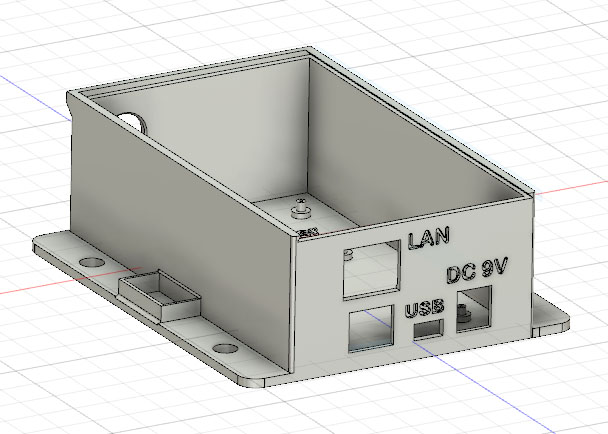
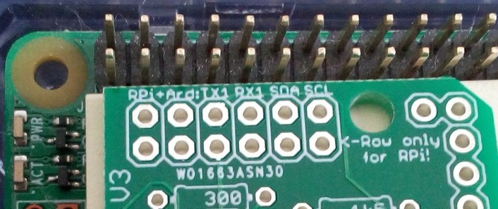

[Back to TOC](toc.md)  
[Back to chapter 11](chap11.md)    
   
---      
    

# 12. Hardware in Conjunction with the BSB-LPB-LAN Adapter
    
    
---
    
## 12.1 The Arduino Due
*In general, the use of an [original Arduino Due](https://store.arduino.cc/arduino-due) is recommended.*  
From experience, however, cheap replicas ("clones") of the Arduino Due can also be used, the use of these clones is usually possible without any problems. But: It should be paid attention if a modified board layout (e.g. changed pin assignments) is described in the prduct description. If this is the case and you still want to buy it, you may need to make specific adjustments in the file *BSB_lan_config.h*.
   
  
   
*A compatible clone of the Arduino Due.*  
   
***Note:***  
Regarding to the [tech specs of the Arduino Due](https://store.arduino.cc/arduino-due), it is recommended to use an external power source at the intended connection of the Arduino (e.g. 9V/1000mA).  
    
    
---
    
## 12.2 The LAN Shield
*In general, the use of an [original Arduino LAN shield (v2)](https://store.arduino.cc/arduino-ethernet-shield-2) is recommended.*  
From experience, however, cheap replicas ("clones") of these LAN shields can also be used, the use of these clones is usually possible without any problems. But: It should be paid attention if a modified board layout (e.g. changed pin assignments) is described in the product description. If this is the case and you still want to buy it, you may need to make specific adjustments in the file *BSB_lan_config.h*.  
   
There are / have been two different versions of LAN shields available on the market: one with a WIZnet W5100 chip (v1) and one with a W5500 chip (v2). The usage of a v2-shield is recommended, it's also available at the official [Arduino store](https://store.arduino.cc/arduino-ethernet-shield-2).  
   
  
   
*A compatible clone of a LAN shield with a W5100 chip.*  
       
***Notes:***     
After the installation of the Arduino IDE it should be checked that the current version of the Ethernet Library (min. v2) is installed.   
As a LAN cable one should preferably use a S/FTP type with a minimum length of one metre.  
   
    
---
   
## 12.3 Usage of Optional Sensors: DHT22 and DS18B20
  
There is the possibility to connect additional sensors (DHT22 and DS18B20) directly to certain pins of the adapter or the Arduino. The necessary libraries for the Arduino IDE are already included in the repository of the BSB-LAN software.  

Usually, the sensors can be connected to GND and +5V of the adapter/Arduino (by usage of the necessary additional pullup-resistors!).  
For the usage of these sensors, one has to activate the belonging definements in the file *BSB_lan_config.h* and has to set the specific pins which are used for DATA (also see [chapter 5](chap05.md)). Make sure you don't use any of the protected pins listed in the file *BSB_lan_config.h*! 
  
After successful installation you can access the values of the sensors either by clicking at the link in the webinterface of BSB-LAN or by using the url command /T.  
   
Besides that, they are also displayed in the [IPWE extension](chap08.md#826-ipwe-extension) by default, which can be accessed by using the URL `<ip-address>/ipwe.cgi`. For using the IPWE extension, one has to activate the belonging definement in the file *BSB_lan_config.h* though.  
   
If you want to log the measured values or if you want to create 24h average calculations, you can realize that by adjusting the belonging parameters in the file *BSB\_lan\_config.h*.  
werden.
  
***Note:***  
*If you are using DS18B20 sensors, the specific sensor id of each sensor will also be listed within the output of /T (and the output of the IPWE extension, if used). Especially if more than one sensor will be added to the system, these unique sensor ids are necessary to identify a specific sensor later. So if you integrate BSB-LAN and/or these sensors in your home automation software, you should consider this (e.g. use RegEx on the sensor ids).  
It's adviseable to read out the sensor id e.g. by using /T) and label each sensor, so that you don't get confused later. for this, you can raise or lower the temperature of one sensor (e.g. hold it in your hand) and query /T again after a certain time. Now you can see the changed value of one sensor and write down the specific sensor id.  
Besides that, if any sensor will be exchanged or added, most of the time the displayed order (within the output of /T or the IPWE extension) of the sensors will change also, because internally they are listed following the specific sensor ids. So if you only adjust the reading following the order and name the sensors like that, it can happen, that the belonging name doesn't show the correct sensor anymore. The following screenshots show this circumstance.*  

*Output of /T with two installed sensors:*  
  
   
*After adding another sensor and rebooting the Arduino, the displayed order changed:*     
  
   
*Note:  
If any changes within the installation of the sensors occur (e.g. if you exchange, add or remove something), you have to reboot the Arduio, so that the sensors will be initially read out and added to the software.*  
  
    
---
    

### 12.3.1 Notes on DHT22 Temperature/Humidity Sensors
  
DHT22 sensors are often advertised as "1 wire", but they are NOT part of the real OneWire bus system by Maxim Integrated and aren't compatible with these components.  
Furthermore they are not even part of any real bus system, because the sensors don't have any specific sensor id and can't be connected to the same DATA-pin if you are using more than one sensor.  
     
Usually these sensors have four pins, but only three of these are connected internally. Most in the time it's the third pin from the left (when viewed from the front) which isn't connected, but you should verify this before soldering.  
The most common pinout is:    
- Pin 1 = VCC (+)  
- Pin 2 = DATA  
- Pin 3 = usually not connected  
- Pin 4 = GND (-)  

When you connect the sensor, an additional pullup resistance has to be placed between VCC (pin 1) and DATA (pin 2) which should be in the range between 4,7kΩ to 10kΩ. In most cases a value of 10kΩ is suggested, but this should be determined individually (especially if any problems with the sensor occur).  
   
***Please note:***    
*If more than one DHT22 sensor should be used, you have to use an own pin at the Arduino for each DATA pin of the sensor. Furthermore you have to define them in the file BSB\_lan\_config.h.*  
        
Besides the 'plain' sensors there are models which are already soldered onto a little circuit board, where the three necessary pins are lead out and labeled. The following picture shows one of these types with the identical sensor AM2302.  
   
  
   
*Note:*  
*You can find various tutorials and examples within the internet about the installation and usage of DHT22 sensors.*
        
---
    
### 12.3.2 Notes on DS18B20 Temperature Sensors
  
Sensors of the type DS18B20 are 'real' 1-wire/OneWire components of Maxim Integrated (initially Dallas Semiconductor).  
Each sensors has a unique internal sensor id which allows the clear identification of a certain sensor within a more complex installation of the bus system - if you wrote down the specific id for each sensor (regard the note in [chapter 12.3](chap12.md#123-usage-of-optional-sensors-dht22-and-ds18b20)).  
Besides the regular TO-92 type they are also available as waterproof capsuled types, which already have a cable connected.  
   
  

Especially for the usage within heating system installations the capsuled type is very interesting, because you can realize an individual (and waterproof!) installation easily and const-effective.  
   
***Notes on the elecrtical installation:***  
Each sensor usually offers three pins: VCC, DATA and GND.  
Within the capsuled types, the colors of belonging wires are often as follows:  
- Red = VCC (+5V)  
- Yellow = DATA  
- Black = GND (-)  
   
If you are using more than one sensor and/or larger cable lengths, it's advisable to add a 100nF ceramic capacitor (and maybe also an addditional 10µF tantal capacitor) for each sensor. The capacitors should be added as close as possible to the sensor and need to be connected between GND and VCC (+5V), so that a brownout at the time of the query will be compensated.  
   
Besides the (optional but advisable) usage of capacitors, you have to use a pullup resistance (only one!) at the output of the adapter/Arduino and place it between DATA and VCC (+5V). If you are using more than one sensor and/or larger cable lengths, you probably have to evaluate the correct dimension of the resistor, which can be smaller than the 4,7kΩ which is suggested most of the times.  
   
*Notes:*  
- If you are using the mentioned capsuled and already wired types, it's usually sufficient to place the capacitors where the wires will be connected. So you don't have to cut the wires at the capsule to place the capacitor there (according to experience, at least with the types which come with a cable length of 1m or 3m it's not necessary).  
- In contrary to ceramic capacitors you have to pay attention to the correct polarity if you are using additional tantal capacitors!  
- It's not advisable to use the 'parsite power mode'.  
- It's advisable to use a shielded cable for the connection. The shield should be connected to GND at one end of the cable. 
- To minimize the risk of electrical interference, try not to lead the cable parallel to power cords. Besides that, you can also add a ferrite ring to minimize the risk of electrical interference which maybe can come from the power supply of the Arduino. Just lead the cable a few times through the ferrite ring.   
   
If you have to use *larger* cable lengths, it's necessary to pay attention to the correct network topology. Have a look at the tutorial which was written from the manufacturer: "[Guidelines for Reliable Long Line 1-Wire Networks](https://www.maximintegrated.com/en/design/technical-documents/tutorials/1/148.html)".  
   
*Note:*  
*You can find various tutorials and examples within the internet about the installation and usage of DS18B20 sensors.*  
   
***Summary of needed parts for an installation:***  
- three-wired cable (if shielded, connect the shield at one end to GND)  
- one pullup resistance 4,7kΩ or maybe smaller, positioned between VCC and DATA at the adapter/Arduino   
- ceramic capacitor 100nF, one for each sensor, positioned between VCC and GND close to the sensor  
- optional: tantal capacitor 10µF, one for each sensor (additional to the ceramic capacitor!), positioned between VCC and GND close to the sensor (please pay attention to the correct polarity!)  
- optional: screw terminals, circuit board, housing, ...   
   
***Notes for the usage within your heating system installation:***  
- If you want to use the capsuled types of sensors, especially within bigger installations it can be adviseable to use the version with 3m cable instead of 1m cable. They are only a little bit more expensive but offer a greater freedom of movement when you want to place the sensors.  
- If you want to place the sensors at some pipes, it's adviseable to create a little bed made of thermal paste for the contact area. Fasten the sensor with a metal pipe clamp to the pipe and also fasten the cable itself with a cable tie, so that tensile forces won't work on the sensor itself and that the sensors stays in place. Of course you need to place the sensor between the pipe an the insulation and close the insulation after you are done with the installation. If there is no pipe insulation it's advisable to -at least- cover the sensor with a piece of insulation, so that it's not affected by any cold air or so.   
- In general, the sensors should me mounted one or two meters away from a heat source, so that they aren't affected by that.  
  
***Please note:***  
***Already installed sensors which belong to the heating system (e.g. sensors for a warm water tank or a heating buffer tank) are always more important than any sensor for your home automation system! The given installation of your existent heating system should never be adversely affected by any optional installed DS18B20 sensor!***  
        
***Construction plan:***  
If you want to set up an installation with more than one sensor and the common capsuled sensors with 1m or 3m cable length, you can build a little 'distribution box'. For this, you can solder the connection wires of the sensors and the belonging capacitors in line onto a circuit board. If you use screw terminals instead of soldering the sensors straight to the board, you can easily add or exchange sensors later. At the 'beginning' of this board, you connect the cable which leads to the adapter/Arduino. The following pictures show two of these little 'distribution boxes' I made - they work perfectly.    
   
  
   
  

        
---
    
## 12.4 Relays and Relayboards
In general it's possible and within BSB-LAN already implemented to connect and query a relay which is connected to the Arduino. By this one couldn't only change the state of a relay by sending a specific command, it's also possible to just query the state.  
***It is NOT possible to connect the Arduino directly with the multifunctional inputs of the controller!***  
   
  

*A single and a 4-channel relaymodule for the usage with an Arduino.*  
       
The often cheap relaymodules available for the usage with an Arduino are often already supplied with a relay which can handle high voltage like 125V or 230V. However, due to poor quality or just an overload, different risky damage can occur. Because of that one should consider to (additionally) use common couple or solid state relays which are used by electricians. in that case one should see the specific data sheet to confirm that the electrical current of the Arduino is strong enough to trigger the swithcing process of the relay.  
   
***WATCH OUT:***  
***Electrical installations should only be done by an electrician! High voltage like 230V or 125V can be deadly!*** *It's adviseable to already include an electrician at the state of planning.*   
   
  
   
*A common coupling relay. At this specific type, the corresponding pins at the Arduino have to be connected with "14" and "13".*  
      

*Example:*  
If the controller of a solarthermic installation isn't already connected with the controller of the heating system, it's possible to query the state of the pump by installing a coupling relay parallel to the pump and connect the other 'side' of the relay with the specific pins of the Arduino. Now you can query the state of the relay and therefore the state of the pump with the Arduino.  
    
---
     
## 12.5 MAX! Components
BSB-LAN is already prepared for the usage of MAX! heating system components. MAX! thermostats that shall be included into BSB-LAN, have to be entered with their serial number (printed on a small label, sometimes in the battery compartment) in the file *BSB\_lan\_config.h* into the array `max_device_list[]`. After starting BSB-LAN, the pairing button has to be pressed on the thermostats in order to establish a connection between BSB-LAN and the thermostats.  
  
In *BSB\_lan\_custom.h* you can use the following variables for using MAX! devices:  
  
- `custom_timer`  
This variable is set to the value of millis() with each iteration of the loop() function.  
  
- `custom_timer_compare`  
This variable can be used in conjunction with `custom_timer` to create timed executions of tasks, for example to execute a function every x milliseconds.  
  
In addition to that, all global variables from *BSB\_lan.ino* are available. In regard to MAX! functionality, these are most notably:  
  
- `max_devices[]`  
This array contains the DeviceID of each paired MAX! device. You can use this for example to exclude specific thermostats from calculations etc.  
  
- `max_cur_temp[]`  
This array contains the current temperature of each thermostat. However, only temperatures from wall thermostats are reliable because they transmit their temperature constantly and regularly. Other thermostats do this only when there is a change in the valve opening or upon a new time schedule.   
  
- `max_dst_temp[]`  
This array contains the desired temperature of each thermostat.  
  
- `max_valve[]`  
This array contains the current valve opening of a thermostat (wall thermostats only carry this value when they are paired with a heater thermostat).  
  
The order inside of these arrays is always the same, i.e. if `max_devices[3]` is wall thermostat with ID xyz in the living room, then `max_cur_temp[3]` contains the current temperature in the living room, `max_dst_temp[3]` the desired temperature in the living room etc.  
  
The order inside `max_devices[]` depends on how the devices have been paired with BSB-LAN and remains the same after restarts of BSB-LAN since they are stored in EEPROM until this is erased by calling `http://<IP-Adresse>/N`. However, one should not completely rely on this and rather compare the ID stored in `max_device[]` for example when planning to ignore a specific thermostat in some kind of calculations. You can obtain this ID from the second column of `http://<IP-Adresse>/X` and take note that this is not the same as the ID printed on the label.  
  
Important note for those users who use a Max!Cube that has been flashed to CUL/CUNO (see information [here](https://forum.fhem.de/index.php/topic,38404.0.html)):  
If BSB-LAN was not running (or was busy otherwise) when the CUNO was set up, then you have to press the pairing button again on these devices, because only in that specific pairing process the ID printed on the devices label is sent together with the internally used device ID (and is also used by FHEM).  
   
You can also use the MAX! thermostats to calculate a weighted or average current or desired temperature (see [here](https://wiki.fhem.de/wiki/MAX) for configuring MAX devices under FHEM and [here](https://forum.fhem.de/index.php/topic,60900.0.html) for using the average temperature in FHEM).  
  
FHEM forum user *„Andreas29"* has created an example on how to use MAX! thermostats with BSB-LAN without using FHEM. A detailed description can be found in this forum post [here](https://forum.fhem.de/index.php/topic,29762.msg851382.html#msg851382). The "Arduino room controller light" is described in chapter [12.6.2](chap12.md#1262-room-temperature-sensor-wemos-d1-mini-dht22-display).  
    
---
    
## 12.6 Own Hardwaresolutions
The following solutions have been developed by BSB-LAN users. They should not only be a stimulation for re-building but also an example what's possible with additional own built hardware solutions in combination with BSB-LAN.  
   
If you also created something by your own of which you think that it could be interesting for other users, please feel free to contact me (Ulf) via email at `adapter (at) quantentunnel.de`, so that I eventually can present it here in the manual. Thanks!  
    
---
    
### 12.6.1 Substitute for a Room Unit (Arduino Uno, LAN Shield, DHT22, Display, Push Button Switch)
The member *„Andreas29"* of the German FHEM forum has built a substitute for a room unit, based on an Arduino Uno. Besides the data from a DHT22 sensor, the current state of function of the heating system is displayed on a 4x20 LCD. With a little push button he imitates the function of the presence button of a common room unit.  
    

    
*The 'inside' of his substitute of a room unit.*  
    

    
*The display of his own built room unit.*  
    
A more detailed description including the circuit diagram and the software is available [here](https://forum.fhem.de/index.php/topic,91867.0.html) in the German FHEM forum.
   
Also, he expanded the functionality and implemented push messaging for certain error cases. The description and the software can be found [here](https://forum.fhem.de/index.php/topic,29762.msg878214.html#msg878214) in the German FHEM forum.
    
---
    
    
### 12.6.2 Room Temperature Sensor (Wemos D1 mini, DHT22, Display)
The member *„Gizmo\_the\_great"* of the FHEM forum has built a room temperature sensor based on a Wemos D1 mini and a DHT22 sensor. The current temperatures on the heating circuits 1 and 2 are additionally displayed at an OLED display. The Wemos D1 ist running ESPeasy.  

A more detailed description of his project you can find in [his GitHub Repo](https://github.com/DaddySun/Smart_Home_DIY).
     
---
    
## 12.7 LAN Options for the BSB-LPB-LAN Adapter
Even though the wired LAN connection is definitely the best option for integrating BSB_LAN into your network, it could be necessary to create an alternative way of connection, because a full-range wired connection (bus cable or LAN cable) just isn't possible.  
Therefore some options will be mentioned in the following subchapters.  
    
---
    
### 12.7.1 Usage of a PowerLAN / dLAN
The use of powerline adapters for expanding the LAN is an option, which could be the best and most reliable solution.  
However, sometimes powerline installations can cause trouble because of possible interferences they may cause. If you have separated phases within your electrical installation, it may just not work though. In that case ask an electrician about a phase coupler that he may could install.    
    
---
    
### 12.7.2 WLAN: Usage of an Additional Router
Another option is to connect the Arduino via LAN with an old router and integrate the router in your network via WLAN as a client. The speed of transmission usually is fast enough for the use of BSB-LAN. If the WLAN signal is weak, you can probably try to change the antennas and mount bigger ones.  
   
However, a stable and reliable WLAN connection should be achieved. Especially, if you are using additional smart home software to create logfiles, if you are using additional hardware like thermostats or if you want to control and influence the behaviour of your heating system.  
    
---  
   
## 12.8 Housing
The market offers just a small range of housings which are compatible for an Arduino Due plus additional shields. Besides commercial products and creative own built solutions, a 3D printer could be used to create a great housing.  
**The member "EPo" of the German FHEM forum was so kind to create and offer STL datafiles for a housing.**  
**Thanks a lot!**  
    
  
  
*3D printer model of the housing for the Arduino Due, the LAN-Shield and the adapter v3.*  
  
The STL data files are already included in the repository of BSB-LAN.  
   
---  
## 12.9 Raspberry Pi

The adapter v3 could also be used in conjunction with a Raspberry Pi. Therefore you have to pay attention to some points: 
- **A usage of the BSB-LAN-Software is NOT possible (see notes below)!**  
- You have to use double-rowed female pin headers which fit the RPi pin (instead of the pin headers for the usage with an Arduino Due).
- With the complete length of the female pin headers (6 pins 'long', so 12 pins in summary) the first pair of the adapter must NOT be plugged to the first pair of the RPi pins (1/2), you have to start with the second pair of the RPi pins (3/4). 
In other words: Make sure that the pin of the adapter labeled as TX1 will fit on the RPi pin 8 (= GPIO 14, UART0_TXD), the pin RX1 in the RPi pin 10 (= GPIO 15, UART0_RXD) and so on.  
*Note:* This counting refers to the official RPi pinout and the naming.  
The picture below shows the plain adapter *next to* the belonging RPi pins just to visualize the displacement/alignment on the longitudinal axis.
- Before the usage of the software, the Pin 7 (GPIO 4) of the RPi must be  
a) defined as an output pin and    
b) set to "HIGH" within the OS of the RPi to achieve the power supply of the adapter.  
Therefore your have to execute two commands in the terminal (probably with a leading 'sudo'):   
`gpio -1 mode 7 output`  
`gpio -1 write 7 1`  
   
  
  
*Exemplary alignment of the adapter along the longitudinal axis of the RPi pins.*  
   
   
***IMPORTANT NOTES:***  
- ***For the usage of the adapter in conjunction with an RPi you have to use a complete different software: ["bsb_gateway"](https://github.com/loehnertj/bsbgateway) by J. Loehnert!***  
- *For any support please contact the author of bsb_gateway!*  
- *We can not and will not provide any support with regard to RPi use!*  
- *From our side, the use of the adapter with the above mentioned software was only tested on an RPi 2. We are not able to judge whether it works properly with more recent RPi versions!*   
- *For the usage of the adapter with an RPi at the PPS interface, the Python script [PPS-monitor](https://github.com/dspinellis/PPS-monitor) by D. Spinellis can be used.*  
  
***This manual only refers to BSB-LAN!***  
   
   
---  
   
[Further on to chapter 13](chap13.md)      
[Back to TOC](toc.md)   
